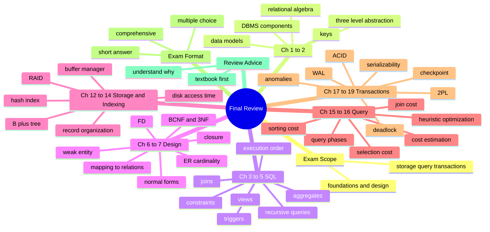

# Final Review 思维导图

```mermaid
mindmap
  root((Final Review))
    Exam Scope
      foundations and design
      storage query transactions
    Ch 1 to 2
      three level abstraction
      data models
      DBMS components
      keys
      relational algebra
    Ch 3 to 5 SQL
      execution order
      aggregates
      joins
      views
      constraints
      triggers
      recursive queries
    Ch 6 to 7 Design
      ER cardinality
      weak entity
      mapping to relations
      FD
      closure
      normal forms
      BCNF and 3NF
    Ch 12 to 14 Storage and Indexing
      disk access time
      RAID
      record organization
      buffer manager
      B plus tree
      hash index
    Ch 15 to 16 Query
      query phases
      selection cost
      sorting cost
      join cost
      heuristic optimization
      cost estimation
    Ch 17 to 19 Transactions
      ACID
      serializability
      anomalies
      2PL
      deadlock
      WAL
      checkpoint
    Exam Format
      multiple choice
      short answer
      comprehensive
    Review Advice
      textbook first
      understand why
```

