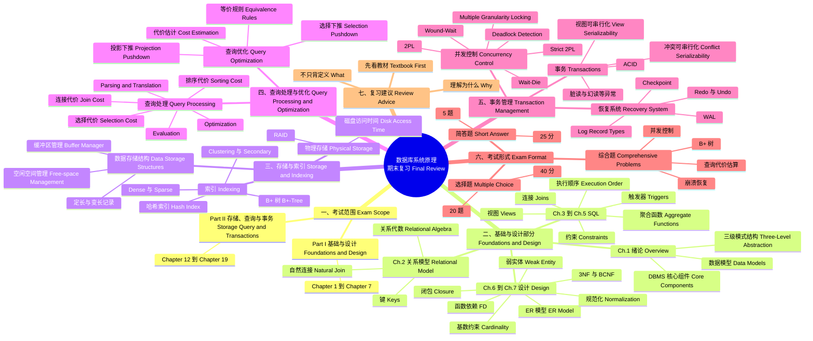

# Final Review 思维导图

```mermaid
mindmap
  root((数据库系统原理<br/>期末复习 Final Review))
    一、考试范围 Exam Scope
      Part I 基础与设计 Foundations and Design
        Chapter 1 到 Chapter 7
      Part II 存储、查询与事务 Storage Query and Transactions
        Chapter 12 到 Chapter 19
    二、基础与设计部分 Foundations and Design
      Ch.1 绪论 Overview
        三级模式结构 Three-Level Abstraction
        数据模型 Data Models
        DBMS 核心组件 Core Components
      Ch.2 关系模型 Relational Model
        键 Keys
        关系代数 Relational Algebra
        自然连接 Natural Join
      Ch.3 到 Ch.5 SQL
        执行顺序 Execution Order
        聚合函数 Aggregate Functions
        连接 Joins
        视图 Views
        约束 Constraints
        触发器 Triggers
      Ch.6 到 Ch.7 设计 Design
        ER 模型 ER Model
        基数约束 Cardinality
        弱实体 Weak Entity
        规范化 Normalization
        函数依赖 FD
        闭包 Closure
        3NF 与 BCNF
    三、存储与索引 Storage and Indexing
      物理存储 Physical Storage
        磁盘访问时间 Disk Access Time
        RAID
      数据存储结构 Data Storage Structures
        定长与变长记录
        空闲空间管理 Free-space Management
        缓冲区管理 Buffer Manager
      索引 Indexing
        B+ 树 B+-Tree
        哈希索引 Hash Index
        Dense 与 Sparse
        Clustering 与 Secondary
    四、查询处理与优化 Query Processing and Optimization
      查询处理 Query Processing
        Parsing and Translation
        Optimization
        Evaluation
        选择代价 Selection Cost
        排序代价 Sorting Cost
        连接代价 Join Cost
      查询优化 Query Optimization
        等价规则 Equivalence Rules
        选择下推 Selection Pushdown
        投影下推 Projection Pushdown
        代价估计 Cost Estimation
    五、事务管理 Transaction Management
      事务 Transactions
        ACID
        冲突可串行化 Conflict Serializability
        视图可串行化 View Serializability
        脏读与幻读等异常
      并发控制 Concurrency Control
        2PL
        Strict 2PL
        Deadlock Detection
        Wait-Die
        Wound-Wait
        Multiple Granularity Locking
      恢复系统 Recovery System
        WAL
        Log Record Types
        Checkpoint
        Redo 与 Undo
    六、考试形式 Exam Format
      选择题 Multiple Choice
        20 题
        40 分
      简答题 Short Answer
        5 题
        25 分
      综合题 Comprehensive Problems
        B+ 树
        查询代价估算
        并发控制
        崩溃恢复
    七、复习建议 Review Advice
      先看教材 Textbook First
      理解为什么 Why
      不只背定义 What
```
