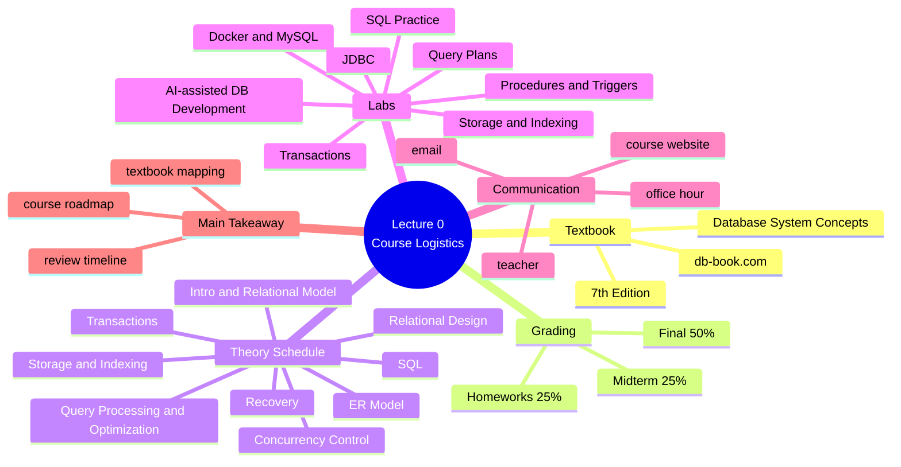

# Lecture 0 思维导图

```mermaid
mindmap
  root((Lecture 0<br/>Course Logistics))
    Textbook
      Database System Concepts
      7th Edition
      db-book.com
    Grading
      Homeworks 25%
      Midterm 25%
      Final 50%
    Theory Schedule
      Intro and Relational Model
      SQL
      ER Model
      Relational Design
      Storage and Indexing
      Query Processing and Optimization
      Transactions
      Concurrency Control
      Recovery
    Labs
      Docker and MySQL
      SQL Practice
      Procedures and Triggers
      JDBC
      Storage and Indexing
      Query Plans
      Transactions
      AI-assisted DB Development
    Communication
      teacher
      office hour
      email
      course website
    Main Takeaway
      course roadmap
      textbook mapping
      review timeline
```

