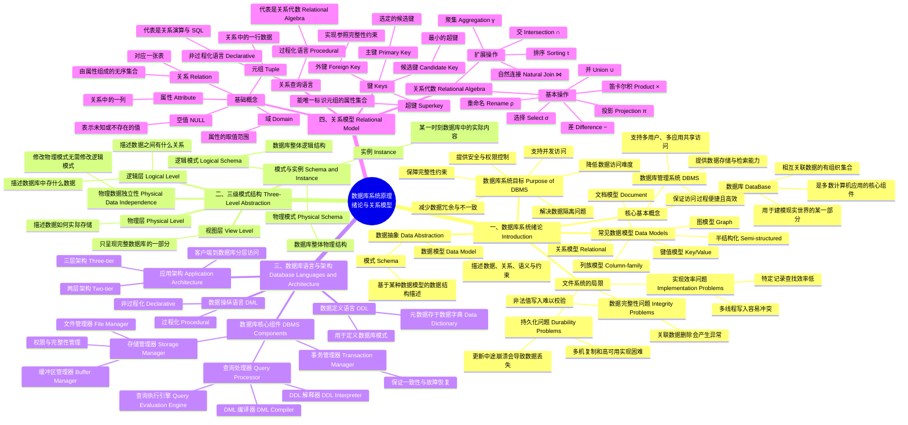

# Lecture 1 思维导图

```mermaid
mindmap
  root((数据库系统原理<br/>绪论与关系模型))
    一、数据库系统绪论 Introduction
      核心基本概念
        数据库 DataBase
          相互关联数据的有组织集合
          用于建模现实世界的某一部分
          是多数计算机应用的核心组件
        数据库管理系统 DBMS
          提供数据存储与检索能力
          保证访问过程便捷且高效
          支持多用户、多应用共享访问
      文件系统的局限
        数据完整性问题 Integrity Problems
          非法值写入难以校验
          关联数据删除会产生异常
        实现效率问题 Implementation Problems
          特定记录查找效率低
          多线程写入容易冲突
        持久化问题 Durability Problems
          更新中途崩溃会导致数据丢失
          多机复制和高可用实现困难
      数据库系统目标 Purpose of DBMS
        减少数据冗余与不一致
        降低数据访问难度
        解决数据隔离问题
        保障完整性约束
        支持并发访问
        提供安全与权限控制
      数据抽象 Data Abstraction
        数据模型 Data Model
          描述数据、关系、语义与约束
        模式 Schema
          基于某种数据模型的数据结构描述
      常见数据模型 Data Models
        关系模型 Relational
        键值模型 Key/Value
        图模型 Graph
        文档模型 Document
        列族模型 Column-family
        半结构化 Semi-structured
    二、三级模式结构 Three-Level Abstraction
      物理层 Physical Level
        描述数据如何实际存储
      逻辑层 Logical Level
        描述数据库中存什么数据
        描述数据之间有什么关系
      视图层 View Level
        只呈现完整数据库的一部分
      物理数据独立性 Physical Data Independence
        修改物理模式无需修改逻辑模式
      模式与实例 Schema and Instance
        逻辑模式 Logical Schema
          数据库整体逻辑结构
        物理模式 Physical Schema
          数据库整体物理结构
        实例 Instance
          某一时刻数据库中的实际内容
    三、数据库语言与架构 Database Languages and Architecture
      数据定义语言 DDL
        用于定义数据库模式
        元数据存于数据字典 Data Dictionary
      数据操纵语言 DML
        过程化 Procedural
        非过程化 Declarative
      数据库核心组件 DBMS Components
        存储管理器 Storage Manager
          文件管理器 File Manager
          缓冲区管理器 Buffer Manager
          权限与完整性管理
        查询处理器 Query Processor
          DDL 解释器 DDL Interpreter
          DML 编译器 DML Compiler
          查询执行引擎 Query Evaluation Engine
        事务管理器 Transaction Manager
          保证一致性与故障恢复
      应用架构 Application Architecture
        两层架构 Two-tier
        三层架构 Three-tier
        客户端到数据库分层访问
    四、关系模型 Relational Model
      基础概念
        关系 Relation
          由属性组成的无序集合
          对应一张表
        元组 Tuple
          关系中的一行数据
        属性 Attribute
          关系中的一列
        域 Domain
          属性的取值范围
        空值 NULL
          表示未知或不存在的值
      键 Keys
        超键 Superkey
          能唯一标识元组的属性集合
        候选键 Candidate Key
          最小的超键
        主键 Primary Key
          选定的候选键
        外键 Foreign Key
          实现参照完整性约束
      关系查询语言
        过程化语言 Procedural
          代表是关系代数 Relational Algebra
        非过程化语言 Declarative
          代表是关系演算与 SQL
      关系代数 Relational Algebra
        基本操作
          选择 Select σ
          投影 Projection π
          并 Union ∪
          差 Difference −
          笛卡尔积 Product ×
          重命名 Rename ρ
        扩展操作
          自然连接 Natural Join ⋈
          交 Intersection ∩
          聚集 Aggregation γ
          排序 Sorting τ
```

