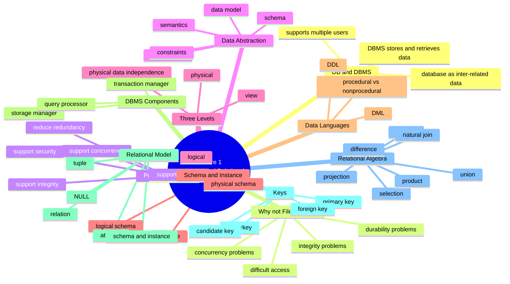

# Lecture 1 思维导图

```mermaid
mindmap
  root((Lecture 1<br/>Introduction and Relational Model))
    DB and DBMS
      database as inter-related data
      DBMS stores and retrieves data
      supports multiple users
    Why not File Systems
      integrity problems
      concurrency problems
      durability problems
      difficult access
    Purpose of DBMS
      reduce redundancy
      support integrity
      support atomicity
      support concurrency
      support security
    Data Abstraction
      data model
      schema
      relationships
      semantics
      constraints
    Three Levels
      physical
      logical
      view
      physical data independence
    Schema and Instance
      logical schema
      physical schema
      instance
    Data Languages
      DDL
      DML
      procedural vs nonprocedural
    DBMS Components
      storage manager
      query processor
      transaction manager
    Relational Model
      relation
      tuple
      attribute
      NULL
      schema and instance
    Keys
      superkey
      candidate key
      primary key
      foreign key
    Relational Algebra
      selection
      projection
      union
      difference
      product
      rename
      natural join
```

