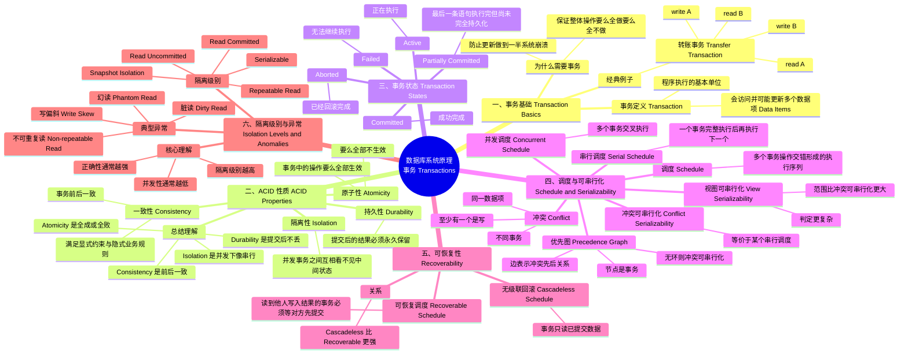

# Lecture 10 思维导图

```mermaid
mindmap
  root((数据库系统原理<br/>事务 Transactions))
    一、事务基础 Transaction Basics
      事务定义 Transaction
        程序执行的基本单位
        会访问并可能更新多个数据项 Data Items
      为什么需要事务
        防止更新做到一半系统崩溃
        保证整体操作要么全做要么全不做
      经典例子
        转账事务 Transfer Transaction
          read A
          write A
          read B
          write B
    二、ACID 性质 ACID Properties
      原子性 Atomicity
        事务中的操作要么全部生效
        要么全部不生效
      一致性 Consistency
        事务前后一致
        满足显式约束与隐式业务规则
      隔离性 Isolation
        并发事务之间互相看不见中间状态
      持久性 Durability
        提交后的结果必须永久保留
      总结理解
        Atomicity 是全成或全败
        Consistency 是前后一致
        Isolation 是并发下像串行
        Durability 是提交后不丢
    三、事务状态 Transaction States
      Active
        正在执行
      Partially Committed
        最后一条语句执行完但尚未完全持久化
      Committed
        成功完成
      Failed
        无法继续执行
      Aborted
        已经回滚完成
    四、调度与可串行化 Schedule and Serializability
      调度 Schedule
        多个事务操作交错形成的执行序列
      串行调度 Serial Schedule
        一个事务完整执行后再执行下一个
      并发调度 Concurrent Schedule
        多个事务交叉执行
      冲突 Conflict
        不同事务
        同一数据项
        至少有一个是写
      冲突可串行化 Conflict Serializability
        等价于某个串行调度
      优先图 Precedence Graph
        节点是事务
        边表示冲突先后关系
        无环则冲突可串行化
      视图可串行化 View Serializability
        范围比冲突可串行化更大
        判定更复杂
    五、可恢复性 Recoverability
      可恢复调度 Recoverable Schedule
        读到他人写入结果的事务必须等对方先提交
      无级联回滚 Cascadeless Schedule
        事务只读已提交数据
      关系
        Cascadeless 比 Recoverable 更强
    六、隔离级别与异常 Isolation Levels and Anomalies
      典型异常
        脏读 Dirty Read
        不可重复读 Non-repeatable Read
        幻读 Phantom Read
        写偏斜 Write Skew
      隔离级别
        Read Uncommitted
        Read Committed
        Repeatable Read
        Serializable
        Snapshot Isolation
      核心理解
        隔离级别越高
        并发性通常越低
        正确性通常越强
```

