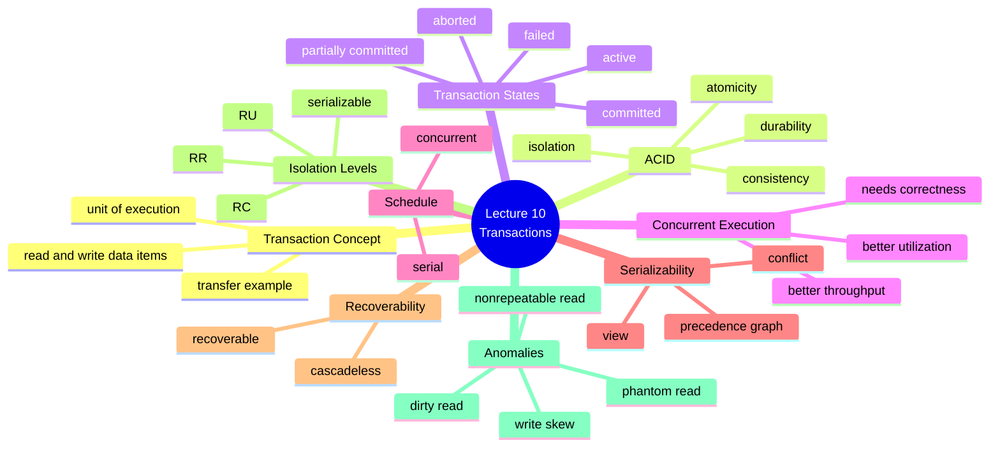

# Lecture 10 思维导图

```mermaid
mindmap
  root((Lecture 10<br/>Transactions))
    Transaction Concept
      unit of execution
      read and write data items
      transfer example
    ACID
      atomicity
      consistency
      isolation
      durability
    Transaction States
      active
      partially committed
      committed
      failed
      aborted
    Concurrent Execution
      better throughput
      better utilization
      needs correctness
    Schedule
      serial
      concurrent
    Serializability
      conflict
      view
      precedence graph
    Recoverability
      recoverable
      cascadeless
    Isolation Levels
      RU
      RC
      RR
      serializable
    Anomalies
      dirty read
      nonrepeatable read
      phantom read
      write skew
```

