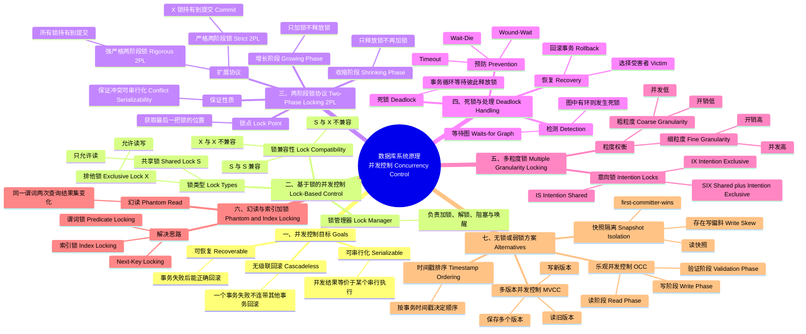

# Lecture 11 思维导图

```mermaid
mindmap
  root((数据库系统原理<br/>并发控制 Concurrency Control))
    一、并发控制目标 Goals
      可串行化 Serializable
        并发结果等价于某个串行执行
      可恢复 Recoverable
        事务失败后能正确回滚
      无级联回滚 Cascadeless
        一个事务失败不连带其他事务回滚
    二、基于锁的并发控制 Lock-Based Control
      锁类型 Lock Types
        共享锁 Shared Lock S
          只允许读
        排他锁 Exclusive Lock X
          允许读写
      锁兼容性 Lock Compatibility
        S 与 S 兼容
        S 与 X 不兼容
        X 与 X 不兼容
      锁管理器 Lock Manager
        负责加锁、解锁、阻塞与唤醒
    三、两阶段锁协议 Two-Phase Locking 2PL
      增长阶段 Growing Phase
        只加锁不释放锁
      收缩阶段 Shrinking Phase
        只释放锁不再加锁
      锁点 Lock Point
        获取最后一把锁的位置
      保证性质
        保证冲突可串行化 Conflict Serializability
      扩展协议
        严格两阶段锁 Strict 2PL
          X 锁持有到提交 Commit
        强严格两阶段锁 Rigorous 2PL
          所有锁持有到提交
    四、死锁与处理 Deadlock Handling
      死锁 Deadlock
        事务循环等待彼此释放锁
      检测 Detection
        等待图 Waits-for Graph
        图中有环则发生死锁
      预防 Prevention
        Wait-Die
        Wound-Wait
        Timeout
      恢复 Recovery
        选择受害者 Victim
        回滚事务 Rollback
    五、多粒度锁 Multiple Granularity Locking
      粒度权衡
        细粒度 Fine Granularity
          并发高
          开销高
        粗粒度 Coarse Granularity
          开销低
          并发低
      意向锁 Intention Locks
        IS Intention Shared
        IX Intention Exclusive
        SIX Shared plus Intention Exclusive
    六、幻读与索引加锁 Phantom and Index Locking
      幻读 Phantom Read
        同一谓词两次查询结果集变化
      解决思路
        谓词锁 Predicate Locking
        索引锁 Index Locking
        Next-Key Locking
    七、无锁或弱锁方案 Alternatives
      时间戳排序 Timestamp Ordering
        按事务时间戳决定顺序
      乐观并发控制 OCC
        读阶段 Read Phase
        验证阶段 Validation Phase
        写阶段 Write Phase
      多版本并发控制 MVCC
        保存多个版本
        读旧版本
        写新版本
      快照隔离 Snapshot Isolation
        读快照
        first-committer-wins
        存在写偏斜 Write Skew
```

