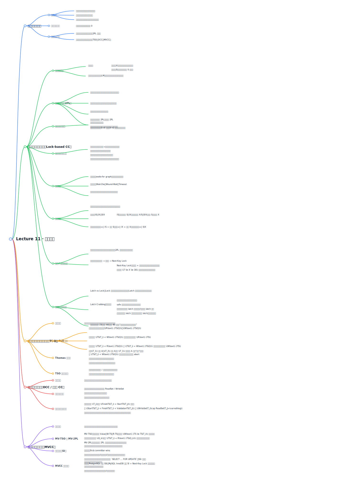

# Lecture 11 并发控制详细思维导图

下面这张图用于快速总览；真正复习时，请直接看图后面的“详细版层级导图”。Lecture 11 的内容非常容易碎片化，所以这份导图刻意按“目标 → 锁协议 → 死锁 → 多粒度 → 索引并发 → 时间戳 → OCC → MVCC/SI”的顺序展开。

## 一、总主线

- Concurrency Control（并发控制）
  - 核心问题
    - 多事务并发执行时，如何仍然保持正确性
    - 如何让事务“看起来像串行执行”
    - 如何在正确性和性能之间取得平衡
  - 核心目标
    - serializable
    - recoverable
    - preferably cascadeless
  - 核心矛盾
    - 串行执行最安全，但并发性能差
    - 并发执行性能高，但会产生冲突、异常、死锁

## 二、并发控制的整体框架

- 为什么需要并发控制
  - 多事务并发能提升吞吐量
  - 可以提高 CPU / I/O 利用率
  - 但并发会带来读写冲突

- 两大思路
  - Lock-based
    - 先加锁，再访问
    - 假设事务会冲突
  - Timestamp-based
    - 不显式加锁
    - 用时间戳定义顺序

- 进一步扩展
  - OCC（Optimistic Concurrency Control）
  - MVCC（Multi-Version Concurrency Control）
  - Snapshot Isolation

## 三、基于锁的并发控制（Lock-Based Protocols）

- 锁的定义
  - lock 是控制并发访问数据项的机制

- 锁模式
  - Shared Lock（S）
    - 只允许读
  - Exclusive Lock（X）
    - 允许读和写

- 锁兼容性
  - S / S：兼容
  - S / X：不兼容
  - X / S：不兼容
  - X / X：不兼容

- Concurrency-Control Manager
  - 负责受理加锁请求
  - 判断是否授予或阻塞

- Automatic Lock Acquisition
  - 用户通常只发 `read(D)` / `write(D)`
  - DBMS 内部自动申请 S/X 锁
  - 写可能触发 upgrade（S -> X）
  - commit / abort 时统一释放锁

- Lock Table
  - 记录 granted locks
  - 记录 pending requests
  - 常由 Lock Manager 管理

## 四、Two-Phase Locking（2PL）

- 2PL 的两个阶段
  - Growing Phase
    - 可以获取锁
    - 不可以释放锁
  - Shrinking Phase
    - 可以释放锁
    - 不可以获取新锁

- 2PL 保证什么
  - conflict serializability

- Lock Point
  - 事务获取到最后一把锁的位置
  - 事务可按 lock point 顺序串行化

- 基本 2PL 的问题
  - 不能避免 cascading aborts
  - 不能避免 deadlocks

- 2PL 扩展
  - Strict 2PL
    - 持有所有 X locks 到 commit / abort
    - 保证 recoverability
    - 避免 cascading rollbacks
  - Rigorous / Strong Strict 2PL
    - 持有所有锁到 commit / abort
    - 可按 commit 顺序串行化
    - 现实数据库里很常见

- Lock Conversions
  - Growing Phase
    - S -> X：upgrade
  - Shrinking Phase
    - X -> S：downgrade

## 五、死锁与饥饿

- Deadlock
  - 事务互相等待对方释放锁
  - 谁也无法推进
  - 必须至少回滚一个事务

- Starvation
  - 某事务长期拿不到资源
  - 一直被推迟或重复回滚

- 死锁处理两大方向
  - Deadlock Detection
  - Deadlock Prevention

### 1. Deadlock Detection

- waits-for graph
  - 节点：事务
  - 边：Ti 等待 Tj 的锁

- 判据
  - 图中有 cycle -> 死锁

- 特点
  - 不会过早回滚
  - 但要周期性检测

### 2. Deadlock Prevention

- wait-die
  - 老事务可以等年轻事务
  - 年轻事务不能等老事务，只能回滚

- wound-wait
  - 老事务不等年轻事务，直接让年轻事务回滚
  - 年轻事务可以等老事务

- Timeout-based scheme
  - 等待超时就回滚
  - 简单但会误杀

### 3. Deadlock Recovery

- 选择 victim
  - 回滚成本最小者优先

- 回滚策略
  - Total rollback
  - Partial rollback（savepoint）

- 避免 starvation
  - 不总是选同一个事务当 victim
  - 例如最老事务不当 victim

## 六、图协议与多粒度锁

### 1. Graph-Based Protocols

- 思路
  - 对数据集施加 partial ordering
  - 按图结构访问和加锁

- 代表
  - tree protocol

- 优点
  - conflict serializable
  - deadlock-free

- 缺点
  - 不保证 recoverability
  - 不保证 cascadeless
  - 可能必须锁住未访问对象

### 2. Multiple Granularity

- 为什么需要
  - 锁可以加在 database / area / file / record 等不同层级
  - 粒度越细，并发越高，但开销越大
  - 粒度越粗，开销越低，但并发越差

- 粒度 tradeoff
  - Fine granularity
    - 高并发
    - 高锁开销
  - Coarse granularity
    - 低开销
    - 低并发

### 3. Intention Locks

- IS（Intention Shared）
  - 表示低层将加 shared locks

- IX（Intention Exclusive）
  - 表示低层将加 exclusive/shared locks

- SIX（Shared + Intention Exclusive）
  - 当前层共享读
  - 子层还会做排他更新

## 七、插入/删除、谓词读取与幻读

- Insert/Delete Rules
  - 删除前必须有 X lock
  - 插入的新 tuple 自动获得 X lock
  - 插入的数据在提交前对别人不可见

- Phantom 问题
  - 锁住已有行，不足以保护“满足某谓词的结果集”
  - 因为别的事务可以插入新行

- Predicate Reads
  - 读的是“满足条件的集合”
  - 不是固定对象集

- Handling Phantoms
  - 需要锁住“关于哪些元组存在”的信息
  - 但这种方法并发性很差

- Predicate Locking
  - 锁逻辑谓词，而不只是具体记录
  - 理论上更强
  - 实现复杂，开销大

## 八、索引并发控制

### 1. Index Locking

- 视作 predicate locking 的高效特例
- 基本规则
  - 每个关系至少有一个索引
  - 查找要锁住经过的 index leaf nodes（S 模式）
  - 插入/删除/更新要对受影响叶子页加 X 锁
  - 仍要遵守 2PL

### 2. Next-Key Locking

- 不只锁满足谓词的键
  - 还锁“下一个键”

- 作用
  - 更准确地保护范围
  - 防止 phantom

- 对插入场景尤其重要

### 3. 为什么索引并发控制特殊

- 索引访问频率很高
- 如果对索引节点也严格做事务级 2PL
  - 并发度会很低

- 关键认识
  - 访问内部节点时，精确读取哪个值不一定重要
  - 只要最终到达正确叶子页、索引结构不坏即可

## 九、Locks vs. Latches

- Locks
  - 保护逻辑内容
  - 面向事务之间的冲突
  - 持有时间长（事务级）
  - 需要支持回滚

- Latches
  - 保护数据结构临界区
  - 面向线程之间的内部同步
  - 持有时间短（操作级）
  - 不需要支持回滚

- 直觉区分
  - lock：事务语义正确性
  - latch：内存结构不被并发线程破坏

## 十、Crabbing / Latch Coupling

### 1. 基本思想

- 从 root 往下走
- 先拿 child latch
- 再放 parent latch

### 2. Safe Node（安全节点）

- 插入时
  - 节点不满，不会 split
- 删除时
  - 节点超过半满，不会 merge / coalesce

如果 child safe，就可提前释放祖先 latch。

### 3. Search

- 沿路拿 R latch
- 拿到子节点后释放父节点

### 4. Insert / Delete

- 沿路按需要拿 W latch
- 若 child safe，则释放祖先 latch

### 5. Better Latch Crabbing

- 乐观地假设目标 leaf safe
- 先沿路拿 R latch
- 到叶子后再检查
- 若发现不安全，再退回保守策略

- 别名
  - optimistic lock coupling

## 十一、Timestamp Ordering（TSO）

- 核心思想
  - 不显式加锁
  - 用时间戳规定事务的串行顺序

- 时间戳分配
  - 每个事务开始时获得唯一 TS(Ti)
  - 新事务时间戳严格更大
  - 可来自逻辑计数器或（wall-clock, logical counter）

- 原则
  - timestamp order = serializability order

### 1. Basic TSO

- 每个数据项 Q 维护
  - W-timestamp(Q)
  - R-timestamp(Q)

- Read rule
  - 若 TS(Ti) < W-TS(Q)，拒绝读并回滚
  - 否则读，并更新 R-TS(Q)

- Write rule
  - 若 TS(Ti) < R-TS(Q)，拒绝写并回滚
  - 若 TS(Ti) < W-TS(Q)，拒绝写并回滚
  - 否则允许写，更新 W-TS(Q)

### 2. TSO 的性质

- 优点
  - serializable
  - deadlock-free

- 缺点
  - not recoverable
  - not cascadeless
  - 长事务容易 starvation
  - 时间戳维护有额外开销

### 3. Thomas’ Write Rule

- 如果：
  - TS(Ti) < W-TS(X)

- 不一定 abort
- 可以直接忽略这个“过时写”
- 让事务继续执行

- 作用
  - 降低不必要回滚

## 十二、Optimistic Concurrency Control（OCC）

- 核心假设
  - 大多数事务不会冲突

- 基本思想
  - 每个事务先在 private workspace 中运行
  - 提交时再验证是否冲突

- 又叫
  - Validation-Based Protocol

### 1. 三阶段

- Read Phase
  - 记录 read set / write set
  - 写只写私有区

- Validation Phase
  - 提交时检查是否与其他事务冲突

- Write Phase
  - 验证成功：写回全局数据库
  - 失败：abort + restart

### 2. 验证时间戳

- StartTS(Ti)
- ValidationTS(Ti)
- FinishTS(Ti)

- 串行化顺序
  - TS(Ti) = ValidationTS(Ti)

### 3. 验证条件直觉

- 若别的事务在你开始前就完成
  - 没问题

- 若与你重叠执行
  - 别人的 WriteSet 不能与你的 ReadSet 冲突

否则验证失败。

## 十三、MVCC（Multi-Version Concurrency Control）

- 基本思想
  - 不覆盖旧值
  - 写成功产生新版本
  - 读读历史版本

- 最大收益
  - reads never have to wait

### 1. Multi-version Timestamp Ordering

- 每个数据项有版本序列
  - Q1, Q2, ..., Qm

- 每个版本包含
  - Content
  - W-timestamp
  - R-timestamp

- 读
  - 选择满足 W-TS <= TS(Ti) 的最新版本

- 写
  - 可能覆盖当前版本
  - 也可能创建新版本

- 性质
  - Reads always succeed
  - 保证 serializability

### 2. Multi-version Two-Phase Locking

- Update transactions
  - 用 SS2PL
  - 创建新版本
  - 提交时统一赋时间戳

- Read-only transactions
  - 开始即拿时间戳
  - 不获取锁
  - 按 MV 时间戳规则读版本

### 3. MVCC 实现问题

- 版本会带来额外存储开销
- 需要 garbage collection
- 主键/外键检查更复杂
- 多版本索引更复杂

## 十四、Snapshot Isolation（SI）

- 核心规则
  - 事务开始时拿 committed data snapshot
  - 一直从自己的 snapshot 读
  - 并发事务的更新对它不可见
  - 自己的更新对自己可见
  - first-committer-wins

### 1. SI 的优点

- 读永不阻塞
- 读也不阻塞别人
- 性能接近 Read Committed
- 避免
  - dirty read
  - lost update
  - non-repeatable read

### 2. SI 的问题

- 不保证真正 serializable
- 可能发生
  - write skew
  - read-only inconsistency
  - 约束检查异常

### 3. SI 在真实系统中的实现

- Oracle
- PostgreSQL
- SQL Server
- IBM DB2

- 注意点
  - Oracle 使用 first updater wins
  - 某些系统的 “serializable” 实际更接近 SI

### 4. Working Around SI Anomalies

- `select ... for update`
  - 把检查逻辑变成带锁读取
  - 可缓解某些写偏斜

- 局限
  - 不能彻底解决 phantom / predicate read 问题

## 十五、Lecture 11 最值得记住的比较关系

- Locking vs Timestamp
  - Locking：等时阻塞
  - Timestamp：不锁但可能频繁回滚

- Basic 2PL vs Strict / Rigorous 2PL
  - Basic：只保串行化
  - Strict：再保 recoverability、避免 cascading aborts
  - Rigorous：更强，直到提交才放所有锁

- Deadlock Detection vs Prevention
  - Detection：先允许等待，再找环
  - Prevention：提前 kill 一方，避免成环

- Locks vs Latches
  - Locks：逻辑正确性
  - Latches：内部结构安全

- TSO vs OCC
  - TSO：时间戳直接管顺序
  - OCC：先假设不冲突，提交时验证

- MVCC / SI vs Locking
  - MVCC/SI：读性能更好
  - 但实现复杂，且 SI 不等于 serializable

## 十六、考试复习抓手

- 主线 1：锁协议
  - S/X locks
  - compatibility
  - 2PL
  - strict 2PL
  - rigorous 2PL

- 主线 2：死锁
  - deadlock
  - starvation
  - waits-for graph
  - wait-die / wound-wait / timeout
  - victim / rollback

- 主线 3：范围与索引并发
  - predicate reads
  - phantom
  - predicate locking
  - index locking
  - next-key locking

- 主线 4：索引结构内部并发
  - locks vs latches
  - latch crabbing
  - safe node
  - optimistic lock coupling

- 主线 5：非锁类协议
  - TSO
  - Thomas’ write rule
  - OCC
  - MVCC
  - SI

## 十七、一句话总括

- 并发控制并不是单纯“防冲突”
  - 而是在
    - 正确性
    - 回滚代价
    - 等待时间
    - 并发度
    - 实现复杂度
  之间做平衡

- 最终目标是：
  - **让事务在并发环境下仍然“看起来像被正确串行化执行”，同时尽量保住系统性能。**
