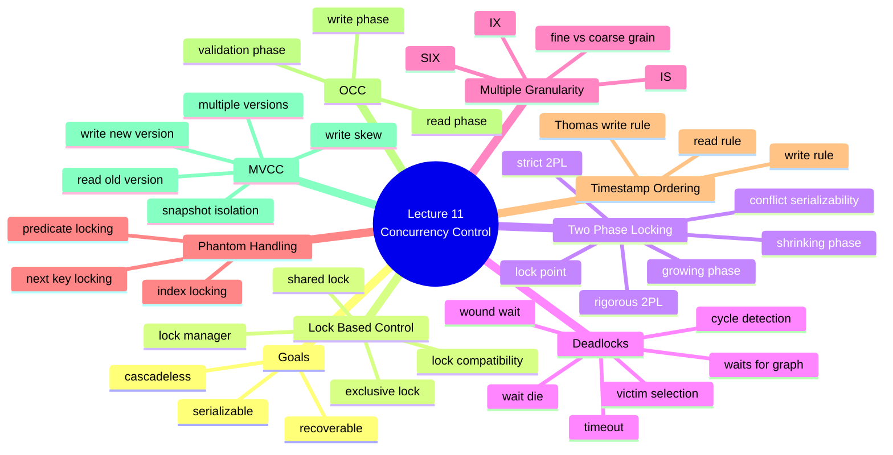

# Lecture 11 思维导图

```mermaid
mindmap
  root((Lecture 11<br/>Concurrency Control))
    Goals
      serializable
      recoverable
      cascadeless
    Lock Based Control
      shared lock
      exclusive lock
      lock compatibility
      lock manager
    Two Phase Locking
      growing phase
      lock point
      shrinking phase
      conflict serializability
      strict 2PL
      rigorous 2PL
    Deadlocks
      waits for graph
      cycle detection
      wait die
      wound wait
      timeout
      victim selection
    Multiple Granularity
      IS
      IX
      SIX
      fine vs coarse grain
    Phantom Handling
      predicate locking
      index locking
      next key locking
    Timestamp Ordering
      read rule
      write rule
      Thomas write rule
    OCC
      read phase
      validation phase
      write phase
    MVCC
      multiple versions
      read old version
      write new version
      snapshot isolation
      write skew
```
