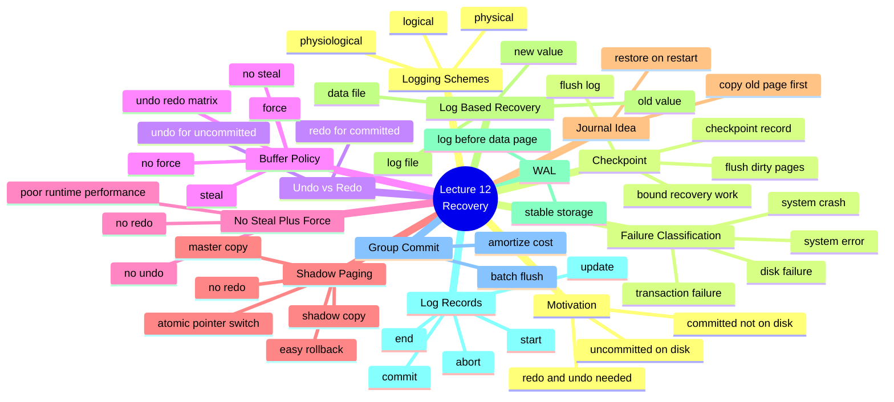

# Lecture 12 思维导图

```mermaid
mindmap
  root((Lecture 12<br/>Recovery))
    Motivation
      committed not on disk
      uncommitted on disk
      redo and undo needed
    Failure Classification
      transaction failure
      system error
      system crash
      disk failure
    Undo vs Redo
      undo for uncommitted
      redo for committed
    Buffer Policy
      steal
      no steal
      force
      no force
      undo redo matrix
    No Steal Plus Force
      no undo
      no redo
      poor runtime performance
    Shadow Paging
      master copy
      shadow copy
      atomic pointer switch
      easy rollback
      no redo
    Journal Idea
      copy old page first
      restore on restart
    Log Based Recovery
      data file
      log file
      old value
      new value
    WAL
      log before data page
      stable storage
    Log Records
      start
      update
      commit
      abort
      end
    Group Commit
      batch flush
      amortize cost
    Logging Schemes
      physical
      logical
      physiological
    Checkpoint
      flush log
      flush dirty pages
      checkpoint record
      bound recovery work
```

