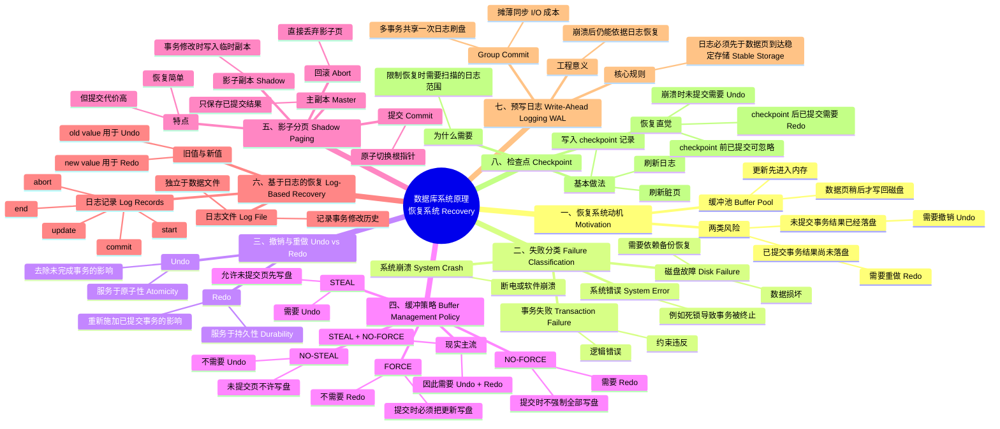

# Lecture 12 思维导图

```mermaid
mindmap
  root((数据库系统原理<br/>恢复系统 Recovery))
    一、恢复系统动机 Motivation
      缓冲池 Buffer Pool
        更新先进入内存
        数据页稍后才写回磁盘
      两类风险
        已提交事务结果尚未落盘
          需要重做 Redo
        未提交事务结果已经落盘
          需要撤销 Undo
    二、失败分类 Failure Classification
      事务失败 Transaction Failure
        逻辑错误
        约束违反
      系统错误 System Error
        例如死锁导致事务被终止
      系统崩溃 System Crash
        断电或软件崩溃
      磁盘故障 Disk Failure
        数据损坏
        需要依赖备份恢复
    三、撤销与重做 Undo vs Redo
      Undo
        去除未完成事务的影响
        服务于原子性 Atomicity
      Redo
        重新施加已提交事务的影响
        服务于持久性 Durability
    四、缓冲策略 Buffer Management Policy
      STEAL
        允许未提交页先写盘
        需要 Undo
      NO-STEAL
        未提交页不许写盘
        不需要 Undo
      FORCE
        提交时必须把更新写盘
        不需要 Redo
      NO-FORCE
        提交时不强制全部写盘
        需要 Redo
      现实主流
        STEAL + NO-FORCE
        因此需要 Undo + Redo
    五、影子分页 Shadow Paging
      主副本 Master
        只保存已提交结果
      影子副本 Shadow
        事务修改时写入临时副本
      提交 Commit
        原子切换根指针
      回滚 Abort
        直接丢弃影子页
      特点
        恢复简单
        但提交代价高
    六、基于日志的恢复 Log-Based Recovery
      日志文件 Log File
        独立于数据文件
        记录事务修改历史
      日志记录 Log Records
        start
        update
        commit
        abort
        end
      旧值与新值
        old value 用于 Undo
        new value 用于 Redo
    七、预写日志 Write-Ahead Logging WAL
      核心规则
        日志必须先于数据页到达稳定存储 Stable Storage
      工程意义
        崩溃后仍能依据日志恢复
      Group Commit
        多事务共享一次日志刷盘
        摊薄同步 I/O 成本
    八、检查点 Checkpoint
      为什么需要
        限制恢复时需要扫描的日志范围
      基本做法
        刷新日志
        刷新脏页
        写入 checkpoint 记录
      恢复直觉
        checkpoint 前已提交可忽略
        checkpoint 后已提交需要 Redo
        崩溃时未提交需要 Undo
```

