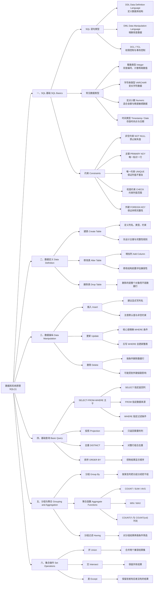

# Lecture 2 思维导图

```mermaid
flowchart LR
  A["数据库系统原理<br/>SQL(1)"]

  A --> B1["一、SQL 基础 SQL Basics"]
  A --> B2["二、数据定义 Data Definition"]
  A --> B3["三、数据操纵 Data Manipulation"]
  A --> B4["四、基础查询 Basic Query"]
  A --> B5["五、分组与聚合 Grouping and Aggregation"]
  A --> B6["六、集合操作 Set Operations"]

  B1 --> C11["SQL 语句类型"]
  B1 --> C12["常见数据类型"]
  B1 --> C13["约束 Constraints"]

  C11 --> D111["DDL Data Definition Language<br/>定义数据库结构"]
  C11 --> D112["DML Data Manipulation Language<br/>增删改查数据"]
  C11 --> D113["DCL / TCL<br/>权限控制与事务控制"]

  C12 --> D121["整数类型 Integer<br/>存放编号、计数等离散值"]
  C12 --> D122["字符串类型 VARCHAR<br/>变长字符数据"]
  C12 --> D123["定点小数 Numeric<br/>适合金额与精度敏感数据"]
  C12 --> D124["时间类型 Timestamp / Date<br/>存放时间点与日期"]

  C13 --> D131["非空约束 NOT NULL<br/>禁止缺失值"]
  C13 --> D132["主键 PRIMARY KEY<br/>唯一标识一行"]
  C13 --> D133["唯一约束 UNIQUE<br/>保证列值不重复"]
  C13 --> D134["检查约束 CHECK<br/>约束列值范围"]
  C13 --> D135["外键 FOREIGN KEY<br/>保证参照完整性"]

  B2 --> C21["建表 Create Table"]
  B2 --> C22["修改表 Alter Table"]
  B2 --> C23["删除表 Drop Table"]

  C21 --> D211["定义列名、类型、约束"]
  C21 --> D212["先设计主键与完整性规则"]
  C22 --> D221["增加列 Add Column"]
  C22 --> D222["修改结构前要评估兼容性"]
  C23 --> D231["删除的是整个对象而不是数据行"]

  B3 --> C31["插入 Insert"]
  B3 --> C32["更新 Update"]
  B3 --> C33["删除 Delete"]

  C31 --> D311["建议显式写列名"]
  C31 --> D312["注意默认值与非空约束"]
  C32 --> D321["核心是精确 WHERE 条件"]
  C32 --> D322["忘写 WHERE 会更新整表"]
  C33 --> D331["按条件删除数据行"]
  C33 --> D332["可能受到外键级联影响"]

  B4 --> C41["SELECT-FROM-WHERE 主干"]
  B4 --> C42["投影 Projection"]
  B4 --> C43["去重 DISTINCT"]
  B4 --> C44["排序 ORDER BY"]

  C41 --> D411["SELECT 指定返回列"]
  C41 --> D412["FROM 指定数据来源"]
  C41 --> D413["WHERE 指定过滤条件"]
  C42 --> D421["只返回需要的列"]
  C43 --> D431["对整行组合去重"]
  C44 --> D441["控制结果显示顺序"]

  B5 --> C51["分组 Group By"]
  B5 --> C52["聚合函数 Aggregate Functions"]
  B5 --> C53["分组过滤 Having"]

  C51 --> D511["按某些列把元组分成若干组"]
  C52 --> D521["COUNT / SUM / AVG"]
  C52 --> D522["MIN / MAX"]
  C52 --> D523["COUNT(*) 与 COUNT(col) 不同"]
  C53 --> D531["对分组结果再做条件筛选"]

  B6 --> C61["并 Union"]
  B6 --> C62["交 Intersect"]
  B6 --> C63["差 Except"]

  C61 --> D611["合并两个兼容结果集"]
  C62 --> D621["保留共有结果"]
  C63 --> D631["保留前者有后者没有的结果"]
```

