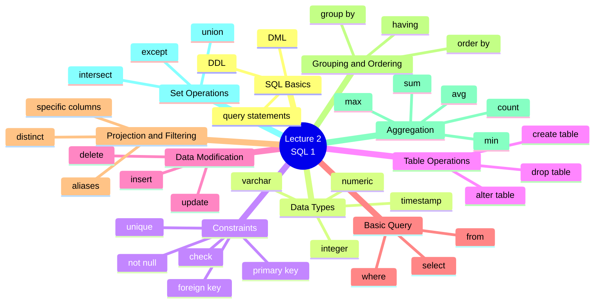

# Lecture 2 思维导图

```mermaid
mindmap
  root((Lecture 2<br/>SQL 1))
    SQL Basics
      DDL
      DML
      query statements
    Data Types
      integer
      varchar
      numeric
      timestamp
    Constraints
      not null
      primary key
      unique
      check
      foreign key
    Table Operations
      create table
      alter table
      drop table
    Data Modification
      insert
      update
      delete
    Basic Query
      select
      from
      where
    Projection and Filtering
      specific columns
      aliases
      distinct
    Grouping and Ordering
      group by
      having
      order by
    Aggregation
      count
      sum
      avg
      min
      max
    Set Operations
      union
      intersect
      except
```

