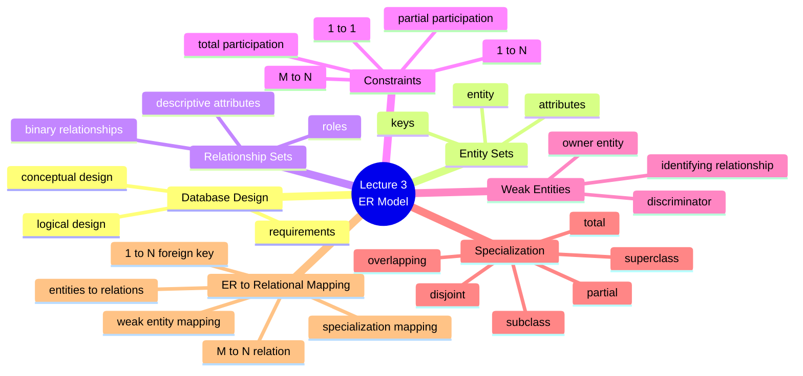

# Lecture 3 思维导图

```mermaid
mindmap
  root((Lecture 3<br/>ER Model))
    Database Design
      requirements
      conceptual design
      logical design
    Entity Sets
      entity
      attributes
      keys
    Relationship Sets
      binary relationships
      roles
      descriptive attributes
    Constraints
      1 to 1
      1 to N
      M to N
      total participation
      partial participation
    Weak Entities
      owner entity
      discriminator
      identifying relationship
    Specialization
      subclass
      superclass
      disjoint
      overlapping
      total
      partial
    ER to Relational Mapping
      entities to relations
      M to N relation
      1 to N foreign key
      weak entity mapping
      specialization mapping
```

