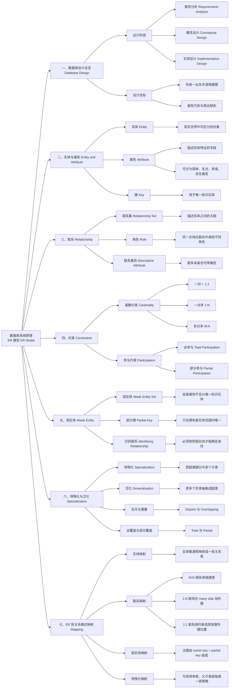

# Lecture 3 思维导图

```mermaid
flowchart LR
  A["数据库系统原理<br/>ER 模型 ER Model"]

  A --> B1["一、数据库设计总览 Database Design"]
  A --> B2["二、实体与属性 Entity and Attribute"]
  A --> B3["三、联系 Relationship"]
  A --> B4["四、约束 Constraints"]
  A --> B5["五、弱实体 Weak Entity"]
  A --> B6["六、特殊化与泛化 Specialization"]
  A --> B7["七、ER 到关系模式映射 Mapping"]

  B1 --> C11["设计阶段"]
  B1 --> C12["设计目标"]

  C11 --> D111["需求分析 Requirements Analysis"]
  C11 --> D112["概念设计 Conceptual Design"]
  C11 --> D113["实现设计 Implementation Design"]
  C12 --> D121["先统一业务术语再建模"]
  C12 --> D122["避免冗余与表达缺失"]

  B2 --> C21["实体 Entity"]
  B2 --> C22["属性 Attribute"]
  B2 --> C23["键 Key"]

  C21 --> D211["现实世界中可区分的对象"]
  C22 --> D221["描述实体特征的字段"]
  C22 --> D222["可分为简单、复合、多值、派生属性"]
  C23 --> D231["用于唯一标识实体"]

  B3 --> C31["联系集 Relationship Set"]
  B3 --> C32["角色 Role"]
  B3 --> C33["联系属性 Descriptive Attribute"]

  C31 --> D311["描述实体之间的关联"]
  C32 --> D321["同一实体在联系中承担不同角色"]
  C33 --> D331["联系本身也可带属性"]

  B4 --> C41["基数约束 Cardinality"]
  B4 --> C42["参与约束 Participation"]

  C41 --> D411["一对一 1:1"]
  C41 --> D412["一对多 1:N"]
  C41 --> D413["多对多 M:N"]
  C42 --> D421["全参与 Total Participation"]
  C42 --> D422["部分参与 Partial Participation"]

  B5 --> C51["弱实体 Weak Entity Set"]
  B5 --> C52["部分键 Partial Key"]
  B5 --> C53["识别联系 Identifying Relationship"]

  C51 --> D511["自身属性不足以唯一标识实体"]
  C52 --> D521["只在拥有者实体范围内唯一"]
  C53 --> D531["必须依附强实体才能确定身份"]

  B6 --> C61["特殊化 Specialization"]
  B6 --> C62["泛化 Generalization"]
  B6 --> C63["互斥与重叠"]
  B6 --> C64["全覆盖与部分覆盖"]

  C61 --> D611["把超类细分为多个子类"]
  C62 --> D621["把多个实体抽象成超类"]
  C63 --> D631["Disjoint 与 Overlapping"]
  C64 --> D641["Total 与 Partial"]

  B7 --> C71["实体映射"]
  B7 --> C72["联系映射"]
  B7 --> C73["弱实体映射"]
  B7 --> C74["特殊化映射"]

  C71 --> D711["实体集通常映射成一张关系表"]
  C72 --> D721["M:N 联系单独建表"]
  C72 --> D722["1:N 联系在 many side 加外键"]
  C72 --> D723["1:1 联系按约束选择放置外键位置"]
  C73 --> D731["主键由 owner key + partial key 组成"]
  C74 --> D741["可采用单表、父子表或每类一表策略"]
```

