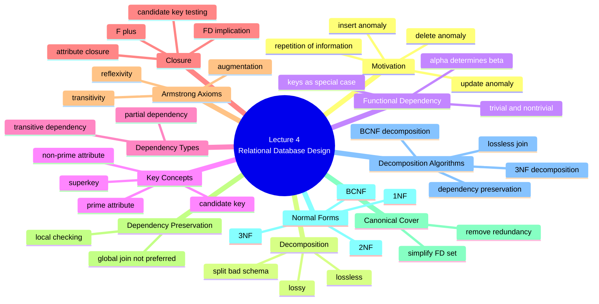

# Lecture 4 思维导图

```mermaid
mindmap
  root((Lecture 4<br/>Relational Database Design))
    Motivation
      repetition of information
      update anomaly
      insert anomaly
      delete anomaly
    Decomposition
      split bad schema
      lossy
      lossless
    Functional Dependency
      alpha determines beta
      keys as special case
      trivial and nontrivial
    Key Concepts
      superkey
      candidate key
      prime attribute
      non-prime attribute
    Dependency Types
      transitive dependency
      partial dependency
    Closure
      F plus
      attribute closure
      candidate key testing
      FD implication
    Armstrong Axioms
      reflexivity
      augmentation
      transitivity
    Dependency Preservation
      local checking
      global join not preferred
    Canonical Cover
      remove redundancy
      simplify FD set
    Normal Forms
      1NF
      2NF
      3NF
      BCNF
    Decomposition Algorithms
      BCNF decomposition
      3NF decomposition
      lossless join
      dependency preservation
```

