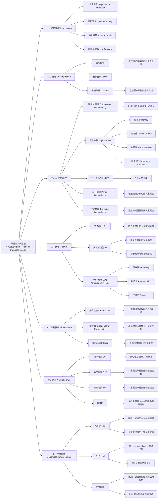

# Lecture 4 思维导图

```mermaid
flowchart LR
  A["数据库系统原理<br/>关系数据库设计 Relational Database Design"]

  A --> B1["一、坏设计问题 Motivation"]
  A --> B2["二、分解 Decomposition"]
  A --> B3["三、函数依赖 FD"]
  A --> B4["四、闭包 Closure"]
  A --> B5["五、保持性质 Preservation"]
  A --> B6["六、范式 Normal Forms"]
  A --> B7["七、分解算法 Decomposition Algorithms"]

  B1 --> C11["信息重复 Repetition of Information"]
  B1 --> C12["更新异常 Update Anomaly"]
  B1 --> C13["插入异常 Insert Anomaly"]
  B1 --> C14["删除异常 Delete Anomaly"]

  B2 --> C21["分解目标"]
  B2 --> C22["有损分解 Lossy"]
  B2 --> C23["无损分解 Lossless"]

  C21 --> D211["把坏模式拆成更好的多个关系"]
  C23 --> D231["连接回去不能产生伪元组"]

  B3 --> C31["函数依赖定义 Functional Dependency"]
  B3 --> C32["键与依赖 Keys and FD"]
  B3 --> C33["平凡依赖 Trivial FD"]
  B3 --> C34["部分依赖 Partial Dependency"]
  B3 --> C35["传递依赖 Transitive Dependency"]

  C31 --> D311["α→β 表示 α 的值唯一决定 β"]
  C32 --> D321["超键 Superkey"]
  C32 --> D322["候选键 Candidate Key"]
  C32 --> D323["主属性 Prime Attribute"]
  C32 --> D324["非主属性 Non-prime Attribute"]
  C33 --> D331["β 是 α 的子集"]
  C34 --> D341["候选键真子集也能决定属性"]
  C35 --> D351["通过中间属性间接决定属性"]

  B4 --> C41["FD 集闭包 F+"]
  B4 --> C42["属性集闭包 α+"]
  B4 --> C43["Armstrong 公理 Armstrong's Axioms"]

  C41 --> D411["由 F 能推出的全部依赖集合"]
  C42 --> D421["由 α 能推出的全部属性"]
  C42 --> D422["用于判断超键与候选键"]
  C43 --> D431["反身性 Reflexivity"]
  C43 --> D432["增广性 Augmentation"]
  C43 --> D433["传递性 Transitivity"]

  B5 --> C51["无损连接 Lossless Join"]
  B5 --> C52["依赖保持 Dependency Preservation"]
  B5 --> C53["Canonical Cover"]

  C51 --> D511["分解后自然连接应还原原关系"]
  C52 --> D521["局部检查依赖而不必全表连接"]
  C53 --> D531["去掉冗余依赖与冗余属性"]

  B6 --> C61["第一范式 1NF"]
  B6 --> C62["第二范式 2NF"]
  B6 --> C63["第三范式 3NF"]
  B6 --> C64["BCNF"]

  C61 --> D611["属性值必须原子 Atomic"]
  C62 --> D621["非主属性不得部分依赖候选键"]
  C63 --> D631["非主属性不得传递依赖超键"]
  C64 --> D641["每个非平凡 FD 左边都必须是超键"]

  B7 --> C71["BCNF 分解"]
  B7 --> C72["3NF 分解"]
  B7 --> C73["两者比较"]

  C71 --> D711["递归分解违反 BCNF 的关系"]
  C71 --> D712["保证无损但不一定保持依赖"]
  C72 --> D721["基于 canonical cover 构造关系"]
  C72 --> D722["保证无损且依赖保持"]
  C73 --> D731["BCNF 更强但更难兼顾依赖保持"]
  C73 --> D732["3NF 更实用且工程上常见"]
```

