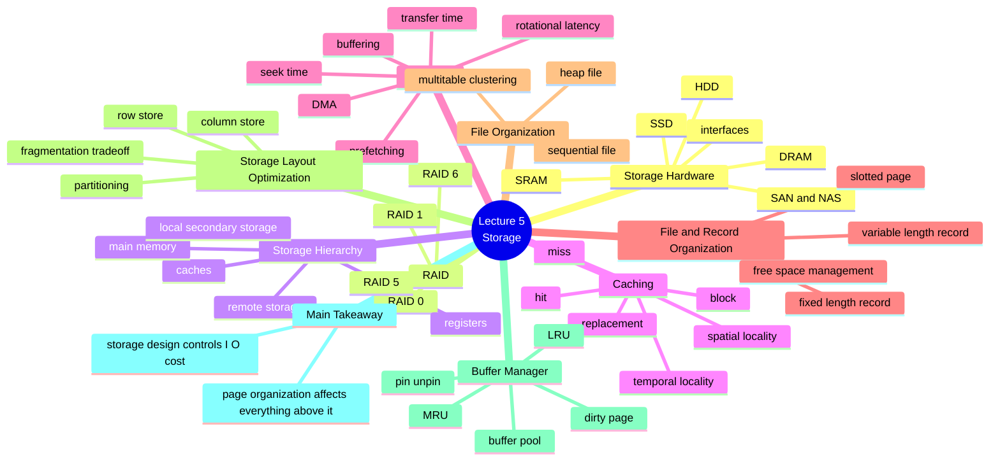

# Lecture 5 思维导图

```mermaid
mindmap
  root((Lecture 5<br/>Storage))
    Storage Hardware
      SRAM
      DRAM
      HDD
      SSD
      interfaces
      SAN and NAS
    RAID
      RAID 0
      RAID 1
      RAID 5
      RAID 6
    Storage Hierarchy
      registers
      caches
      main memory
      local secondary storage
      remote storage
    Caching
      temporal locality
      spatial locality
      block
      hit
      miss
      replacement
    Disk I O
      seek time
      rotational latency
      transfer time
      DMA
      buffering
      prefetching
    File and Record Organization
      fixed length record
      variable length record
      slotted page
      free space management
    File Organization
      heap file
      sequential file
      multitable clustering
    Storage Layout Optimization
      partitioning
      row store
      column store
      fragmentation tradeoff
    Buffer Manager
      buffer pool
      pin unpin
      LRU
      MRU
      dirty page
    Main Takeaway
      storage design controls I O cost
      page organization affects everything above it
```

