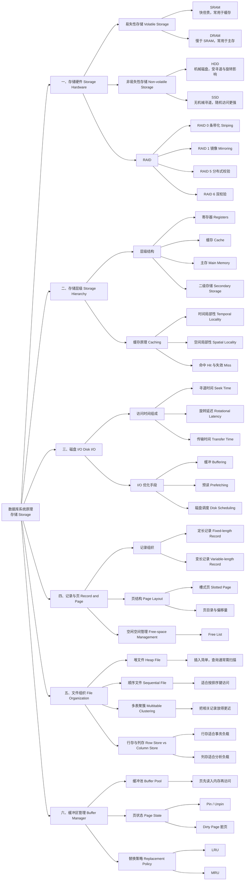

# Lecture 5 思维导图

```mermaid
flowchart LR
  A["数据库系统原理<br/>存储 Storage"]

  A --> B1["一、存储硬件 Storage Hardware"]
  A --> B2["二、存储层级 Storage Hierarchy"]
  A --> B3["三、磁盘 I/O Disk I/O"]
  A --> B4["四、记录与页 Record and Page"]
  A --> B5["五、文件组织 File Organization"]
  A --> B6["六、缓冲区管理 Buffer Manager"]

  B1 --> C11["易失性存储 Volatile Storage"]
  B1 --> C12["非易失性存储 Non-volatile Storage"]
  B1 --> C13["RAID"]

  C11 --> D111["SRAM<br/>快但贵，常用于缓存"]
  C11 --> D112["DRAM<br/>慢于 SRAM，常用于主存"]
  C12 --> D121["HDD<br/>机械磁盘，受寻道与旋转影响"]
  C12 --> D122["SSD<br/>无机械寻道，随机访问更强"]
  C13 --> D131["RAID 0 条带化 Striping"]
  C13 --> D132["RAID 1 镜像 Mirroring"]
  C13 --> D133["RAID 5 分布式校验"]
  C13 --> D134["RAID 6 双校验"]

  B2 --> C21["层级结构"]
  B2 --> C22["缓存原理 Caching"]

  C21 --> D211["寄存器 Registers"]
  C21 --> D212["缓存 Cache"]
  C21 --> D213["主存 Main Memory"]
  C21 --> D214["二级存储 Secondary Storage"]
  C22 --> D221["时间局部性 Temporal Locality"]
  C22 --> D222["空间局部性 Spatial Locality"]
  C22 --> D223["命中 Hit 与失效 Miss"]

  B3 --> C31["访问时间组成"]
  B3 --> C32["I/O 优化手段"]

  C31 --> D311["寻道时间 Seek Time"]
  C31 --> D312["旋转延迟 Rotational Latency"]
  C31 --> D313["传输时间 Transfer Time"]
  C32 --> D321["缓冲 Buffering"]
  C32 --> D322["预读 Prefetching"]
  C32 --> D323["磁盘调度 Disk Scheduling"]

  B4 --> C41["记录组织"]
  B4 --> C42["页结构 Page Layout"]
  B4 --> C43["空闲空间管理 Free-space Management"]

  C41 --> D411["定长记录 Fixed-length Record"]
  C41 --> D412["变长记录 Variable-length Record"]
  C42 --> D421["槽式页 Slotted Page"]
  C42 --> D422["页目录与偏移量"]
  C43 --> D431["Free List"]

  B5 --> C51["堆文件 Heap File"]
  B5 --> C52["顺序文件 Sequential File"]
  B5 --> C53["多表聚簇 Multitable Clustering"]
  B5 --> C54["行存与列存 Row Store vs Column Store"]

  C51 --> D511["插入简单，查询通常需扫描"]
  C52 --> D521["适合按排序键访问"]
  C53 --> D531["把相关记录放得更近"]
  C54 --> D541["行存适合事务负载"]
  C54 --> D542["列存适合分析负载"]

  B6 --> C61["缓冲池 Buffer Pool"]
  B6 --> C62["页状态 Page State"]
  B6 --> C63["替换策略 Replacement Policy"]

  C61 --> D611["页先读入内存再访问"]
  C62 --> D621["Pin / Unpin"]
  C62 --> D622["Dirty Page 脏页"]
  C63 --> D631["LRU"]
  C63 --> D632["MRU"]
```

