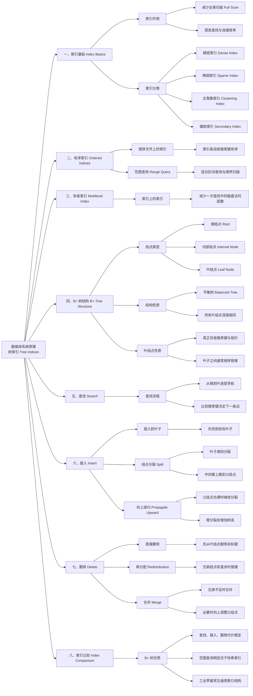

# Lecture 6 思维导图

```mermaid
flowchart LR
  A["数据库系统原理<br/>树索引 Tree Indices"]

  A --> B1["一、索引基础 Index Basics"]
  A --> B2["二、有序索引 Ordered Indices"]
  A --> B3["三、多级索引 Multilevel Index"]
  A --> B4["四、B+ 树结构 B+-Tree Structure"]
  A --> B5["五、查找 Search"]
  A --> B6["六、插入 Insert"]
  A --> B7["七、删除 Delete"]
  A --> B8["八、索引比较 Index Comparison"]

  B1 --> C11["索引作用"]
  B1 --> C12["索引分类"]

  C11 --> D111["减少全表扫描 Full Scan"]
  C11 --> D112["提高查找与连接效率"]
  C12 --> D121["稠密索引 Dense Index"]
  C12 --> D122["稀疏索引 Sparse Index"]
  C12 --> D123["主聚簇索引 Clustering Index"]
  C12 --> D124["辅助索引 Secondary Index"]

  B2 --> C21["顺序文件上的索引"]
  B2 --> C22["范围查询 Range Query"]

  C21 --> D211["索引条目按搜索键有序"]
  C22 --> D221["适合区间查询与顺序扫描"]

  B3 --> C31["索引上的索引"]
  C31 --> D311["减少一次查找中的磁盘访问层数"]

  B4 --> C41["结点类型"]
  B4 --> C42["结构性质"]
  B4 --> C43["叶结点性质"]

  C41 --> D411["根结点 Root"]
  C41 --> D412["内部结点 Internal Node"]
  C41 --> D413["叶结点 Leaf Node"]
  C42 --> D421["平衡树 Balanced Tree"]
  C42 --> D422["所有叶结点深度相同"]
  C43 --> D431["真正存放搜索键与指针"]
  C43 --> D432["叶子之间通常顺序链接"]

  B5 --> C51["查找流程"]
  C51 --> D511["从根到叶逐层导航"]
  C51 --> D512["比较搜索键决定下一条边"]

  B6 --> C61["插入到叶子"]
  B6 --> C62["结点分裂 Split"]
  B6 --> C63["向上递归 Propagate Upward"]

  C61 --> D611["先找到目标叶子"]
  C62 --> D621["叶子满则分裂"]
  C62 --> D622["中间键上推到父结点"]
  C63 --> D631["父结点也满时继续分裂"]
  C63 --> D632["根分裂会增加树高"]

  B7 --> C71["直接删除"]
  B7 --> C72["再分配 Redistribution"]
  B7 --> C73["合并 Merge"]

  C71 --> D711["先从叶结点删除目标键"]
  C72 --> D721["兄弟结点有富余时借键"]
  C73 --> D731["兄弟不足时合并"]
  C73 --> D732["必要时向上调整父结点"]

  B8 --> C81["B+ 树优势"]
  C81 --> D811["查找、插入、删除代价稳定"]
  C81 --> D812["范围查询明显优于哈希索引"]
  C81 --> D813["工业界最常见通用索引结构"]
```

