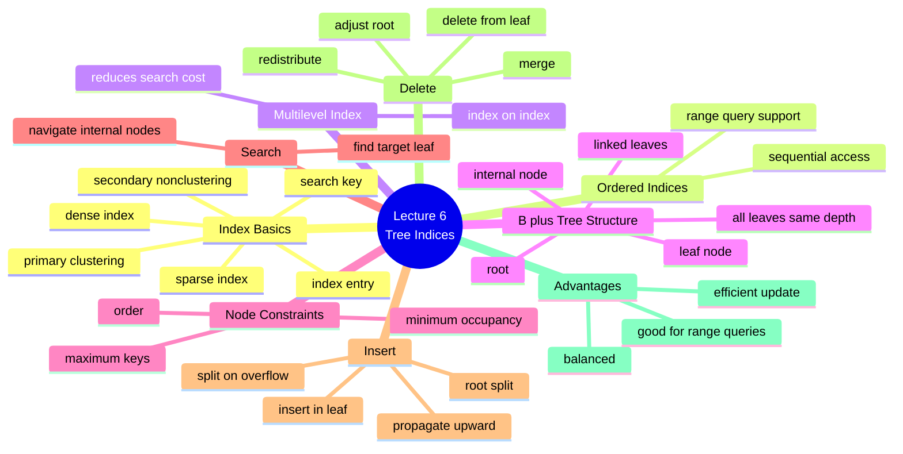

# Lecture 6 思维导图

```mermaid
mindmap
  root((Lecture 6<br/>Tree Indices))
    Index Basics
      search key
      index entry
      primary clustering
      secondary nonclustering
      dense index
      sparse index
    Ordered Indices
      sequential access
      range query support
    Multilevel Index
      index on index
      reduces search cost
    B plus Tree Structure
      root
      internal node
      leaf node
      all leaves same depth
      linked leaves
    Node Constraints
      order
      minimum occupancy
      maximum keys
    Search
      navigate internal nodes
      find target leaf
    Insert
      insert in leaf
      split on overflow
      propagate upward
      root split
    Delete
      delete from leaf
      redistribute
      merge
      adjust root
    Advantages
      balanced
      good for range queries
      efficient update
```

