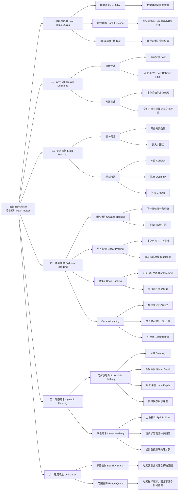

# Lecture 7 思维导图

```mermaid
flowchart LR
  A["数据库系统原理<br/>哈希索引 Hash Indices"]

  A --> B1["一、哈希表基础 Hash Table Basics"]
  A --> B2["二、设计决策 Design Decisions"]
  A --> B3["三、静态哈希 Static Hashing"]
  A --> B4["四、冲突处理 Collision Handling"]
  A --> B5["五、动态哈希 Dynamic Hashing"]
  A --> B6["六、适用场景 Use Cases"]

  B1 --> C11["哈希表 Hash Table"]
  B1 --> C12["哈希函数 Hash Function"]
  B1 --> C13["桶 Bucket / 槽 Slot"]

  C11 --> D111["把键映射到值的位置"]
  C12 --> D121["把大键空间压缩到较小地址空间"]
  C13 --> D131["保存元素的物理位置"]

  B2 --> C21["函数设计"]
  B2 --> C22["方案设计"]

  C21 --> D211["追求快速 Fast"]
  C21 --> D212["追求低冲突 Low Collision Rate"]
  C22 --> D221["冲突后如何定位元素"]
  C22 --> D222["空间开销与查找成本之间权衡"]

  B3 --> C31["基本假设"]
  B3 --> C32["现实问题"]

  C31 --> D311["预估元素数量"]
  C31 --> D312["表大小固定"]
  C32 --> D321["冲突 Collision"]
  C32 --> D322["溢出 Overflow"]
  C32 --> D323["扩容 Growth"]

  B4 --> C41["链地址法 Chained Hashing"]
  B4 --> C42["线性探测 Linear Probing"]
  B4 --> C43["Robin Hood Hashing"]
  B4 --> C44["Cuckoo Hashing"]

  C41 --> D411["同一槽位挂一条桶链"]
  C41 --> D412["查找时顺链扫描"]
  C42 --> D421["冲突后找下一个空槽"]
  C42 --> D422["容易形成聚集 Clustering"]
  C43 --> D431["记录位移距离 Displacement"]
  C43 --> D432["让探测长度更均衡"]
  C44 --> D441["使用多个哈希函数"]
  C44 --> D442["插入时可踢出已有元素"]
  C44 --> D443["出现循环时需要重建"]

  B5 --> C51["可扩展哈希 Extendible Hashing"]
  B5 --> C52["线性哈希 Linear Hashing"]

  C51 --> D511["目录 Directory"]
  C51 --> D512["全局深度 Global Depth"]
  C51 --> D513["局部深度 Local Depth"]
  C51 --> D514["桶分裂与目录翻倍"]
  C52 --> D521["分裂指针 Split Pointer"]
  C52 --> D522["逐步扩容而非一次翻倍"]
  C52 --> D523["溢出后按顺序处理分裂"]

  B6 --> C61["等值查询 Equality Search"]
  B6 --> C62["范围查询 Range Query"]
  C61 --> D611["哈希索引非常适合精确匹配"]
  C62 --> D621["哈希破坏顺序，因此不适合区间查询"]
```

