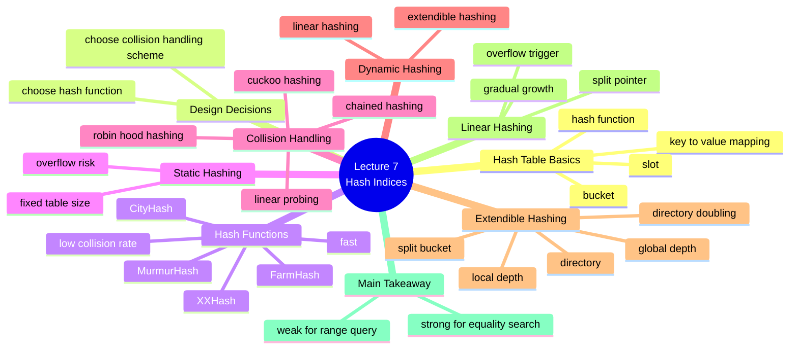

# Lecture 7 思维导图

```mermaid
mindmap
  root((Lecture 7<br/>Hash Indices))
    Hash Table Basics
      key to value mapping
      hash function
      slot
      bucket
    Design Decisions
      choose hash function
      choose collision handling scheme
    Hash Functions
      fast
      low collision rate
      MurmurHash
      CityHash
      XXHash
      FarmHash
    Static Hashing
      fixed table size
      overflow risk
    Collision Handling
      chained hashing
      linear probing
      robin hood hashing
      cuckoo hashing
    Dynamic Hashing
      extendible hashing
      linear hashing
    Extendible Hashing
      directory
      global depth
      local depth
      split bucket
      directory doubling
    Linear Hashing
      split pointer
      gradual growth
      overflow trigger
    Main Takeaway
      strong for equality search
      weak for range query
```

