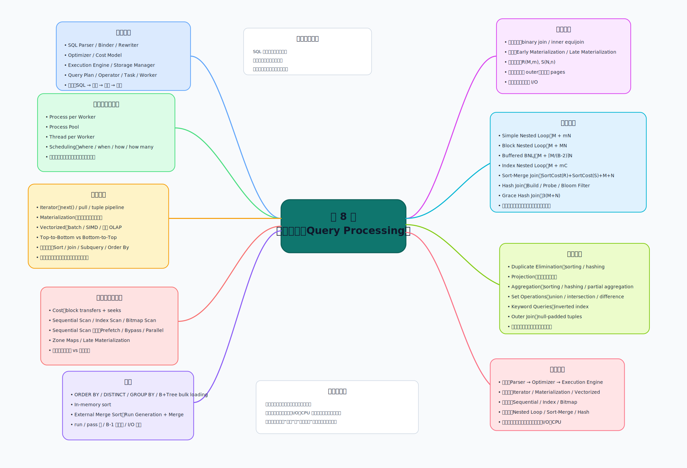

# 查询处理详细思维导图（Lecture8）

下面这张图用于快速总览；真正复习时，请直接看图后面的“详细版层级导图”。这样既能先抓全局，也能按层展开到考试级细节。

## 一、总主线

- Query Processing（查询处理）
  - 核心问题
    - 一条 SQL 如何被解析
    - 如何被转成查询计划（query plan）
    - 查询计划中的操作符如何执行
    - 每个操作符具体选择什么物理算法
    - 优化器如何用代价估计选择方案
  - 总公式化理解
    - SQL 执行 = 解析 + 重写 + 优化 + 执行 + 存储访问
    - 更完整地说：
      - SQL 执行 = 执行模型 + 访问方法 + 排序/连接算法 + 代价模型 + 调度策略

## 二、总体架构（Architecture Overview）

- 系统分层
  - Networking Layer
    - 接收客户端请求
    - 把 SQL 请求送入数据库内部处理流程
  - Planner / Compiler
    - 负责把 SQL 转成内部可执行形式
  - Execution Engine
    - 真正运行操作符
  - Storage Manager
    - 负责页、文件、索引、缓冲、日志等底层数据访问

- 查询编译链路
  - SQL Parser（解析器）
    - 把 SQL 转换成语法树
    - 关注语法是否合法
  - Binder（绑定器）
    - 把表名、列名绑定到真实数据库对象
    - 判断列属于哪张表
    - 处理别名、作用域
  - Rewriter（重写器）
    - 做逻辑等价变换
    - 例如谓词下推（predicate pushdown）
    - 子查询改写
    - 代数表达式整理
  - Optimizer（优化器）
    - 枚举不同计划
    - 估算代价
    - 选择较优执行计划
  - Cost Model（代价模型）
    - 估算 I/O 开销
    - 估算 CPU 开销
    - 估算内存消耗

- 执行相关模块
  - Access Methods / Indexes
    - 决定数据怎么取
    - 顺序扫描、索引扫描、位图扫描
  - Operator Execution
    - 决定算子如何执行
  - Scheduling / Placement
    - 决定 task 在哪里、何时、如何运行
  - Concurrency Control
    - 与并发事务有关
    - 保证并发访问正确性
  - Logging / Checkpoints
    - 与恢复相关
    - 不属于查询处理主线，但会影响执行环境

## 三、查询执行的基本单位

- Query Plan（查询计划）
  - 由多个 operators 组成
  - 常见 operator
    - Scan
    - Selection
    - Projection
    - Join
    - Sort
    - Aggregation

- Operator Instance（操作符实例）
  - 某个操作符在某一段数据上的一次具体执行
  - 同一个逻辑 operator 可映射为多个实例
  - 在并行执行中更常见

- Task（任务）
  - 一个或多个 operator instances 组成的执行单元
  - 是调度器处理的对象

- Worker（工作者）
  - 真正代表客户端执行任务的实体
  - 可能是进程，也可能是线程

## 四、进程模型（Process Models）

- Process per DBMS Worker
  - 每个 worker 一个独立进程
  - 优点
    - 隔离性强
    - 崩溃影响相对局部
  - 缺点
    - context switch 开销较大
    - 管理进程成本高

- Process Pool
  - 预先创建一组进程
  - 查询到来后复用
  - 优点
    - 避免反复创建/销毁进程
  - 缺点
    - 池管理复杂
    - 资源协调复杂

- Thread per DBMS Worker
  - 每个 worker 一个线程
  - 优点
    - 上下文切换成本更低
    - 内存共享更直接
  - 缺点
    - 共享内存同步更难
    - 锁竞争、线程安全问题更突出

## 五、调度（Scheduling）

- 调度要回答的 4 类问题
  - where：任务在哪个位置执行
  - when：任务何时执行
  - how：任务如何执行
  - how many：使用多少任务/核心

- 具体决策项
  - 一个查询计划拆成多少 tasks
  - 每个 task 用几个 CPU cores
  - task 绑定到哪个核心
  - 中间结果存储在哪里
  - 是否启用并行
  - 是否让多个 worker 同时参与

- 为什么 DBMS 比 OS 更懂调度
  - OS 只知道线程/进程
  - DBMS 知道
    - 哪些算子是阻塞的
    - 哪些算子是流水线的
    - 哪些阶段会占大内存
    - 哪些连接适合并行

## 六、执行优化（Execution Optimization）

- 目标
  - 提高查询执行性能
  - 尤其是内存数据集上的性能

- 三条主线
  - Reduce Instruction Count（减少指令数）
    - 同样工作用更少指令完成
    - 减少多余逻辑
    - 减少函数层层调用
  - Reduce Cycles per Instruction（降低每条指令周期数）
    - 提高 CPU 执行效率
    - 提高缓存命中率
    - 降低分支预测失败
    - 减少随机访存
  - Parallelize Execution（并行化执行）
    - 用多个线程共同处理一个查询
    - 提高吞吐和响应速度

## 七、处理模型（Processing Models）

- 核心问题
  - 操作符之间怎么传数据
  - 一次传多少数据
  - 父子算子谁驱动谁
  - 更适合 OLTP 还是 OLAP

### 1. 迭代器模型（Iterator Model）

- 别名
  - Volcano Model
  - Pipeline Model

- 核心机制
  - 每个算子实现 `next()`
  - 每次调用返回一条 tuple
  - 无更多结果时返回空标记
  - 父算子不断向子算子拉取数据

- 直观执行过程
  - Projection 要一条结果
  - 向 Join 请求一条
  - Join 再向左右孩子请求
  - 直到 Scan 读出底层 tuple

- 优点
  - 通用性强
  - 架构清晰
  - 容易形成 tuple pipelining
  - 边算边输出容易

- 缺点
  - 函数调用次数多
  - 一次处理一条 tuple
  - 对现代 CPU 不够友好
  - 不利于 SIMD

- 阻塞算子
  - Join
  - Subquery
  - Order By
  - Sorting
  - 某些聚合

### 2. 物化模型（Materialization Model）

- 核心机制
  - 算子一次性处理完所有输入
  - 一次性产生完整输出
  - 把中间结果物化出来

- 输出形式
  - 整行 row
  - 某几列 columns
  - 可用于 NSM（行存）
  - 可用于 DSM（列存）

- 优点
  - 协调成本低
  - 函数调用更少
  - 小查询更直接

- 缺点
  - 中间结果大时开销高
  - 占内存或磁盘
  - 分析型查询不一定划算

- 适合场景
  - OLTP
  - 只访问少量元组
  - 更关注延迟而非极致吞吐

### 3. 向量化/批处理模型（Vectorized / Batch Model）

- 核心机制
  - 仍然有 `next()`
  - 但每次返回一批 tuples
  - 批大小可以调节

- 优点
  - 显著减少 operator 调用次数
  - 更适合 SIMD
  - 更适合 cache line
  - 更适合现代 CPU 流水线

- 缺点
  - 实现更复杂
  - batch size 需要权衡
  - 批太小收益不大
  - 批太大可能浪费内存

- 适合场景
  - OLAP
  - 大扫描、大聚合、大连接

### 4. 三种模型对比总结

- Iterator
  - 通用
  - 经典
  - 灵活
  - 调用开销高

- Materialization
  - 对小结果友好
  - 中间结果大时代价高

- Vectorized
  - 更偏现代分析型数据库
  - CPU 利用率更高

## 八、计划处理方向（Plan Processing Direction）

- Top-to-Bottom
  - 从根节点开始
  - pull 模式
  - 父节点向子节点要数据

- Bottom-to-Top
  - 从叶子开始
  - push 模式
  - 子节点把数据推给父节点

- 对比
  - pull
    - 逻辑更自然
    - 易于做 iterator 风格控制
  - push
    - 更利于紧凑 pipeline
    - 有时更利于 cache 和寄存器优化

## 九、查询代价（Measures of Query Cost）

- 磁盘代价通常由三部分构成
  - number of seeks
  - number of blocks read
  - number of blocks written

- 课程中的简化视角
  - block transfers（块传输次数）
  - seeks（寻道次数）

- 为什么只估算而不是精确计算
  - 数据可能已在 buffer 中
  - 并发查询会争抢内存
  - 操作系统也占用内存
  - 真实可用缓冲区会动态变化

- 两种估计思路
  - worst case
    - 假设一开始不在 buffer 中
    - 仅有最低所需内存
  - optimistic estimate
    - 假设存在一定缓存命中
    - 更接近实际系统

## 十、选择（Selection）与访问方法（Access Methods）

### 1. 访问方法定义

- Access Method
  - DBMS 如何访问表中的数据
  - 不属于关系代数算子本身
  - 但决定物理执行方式

### 2. 三类基本访问方法

- Sequential Scan / File Scan
- Index Scan
- Multi-Index Scan / Bitmap Scan

### 3. 顺序扫描（Sequential Scan）

- 基本流程
  - 按页扫描整张表
  - 每页遍历所有 tuples
  - 检查每条 tuple 是否满足谓词

- 内部机制
  - DBMS 维护 cursor
  - 记录已经访问到的 page / slot

- 优点
  - 最通用
  - 没索引时一定能做
  - 对所有条件都适用

- 缺点
  - 选择性高的查询很浪费
  - 返回少量记录也可能扫全表

### 4. 顺序扫描优化

- Prefetching
  - 预取后续页
  - 减少等待磁盘时间

- Buffer Pool Bypass
  - 大顺序扫描不必污染缓冲池

- Parallelization
  - 多线程分段扫描

- Heap Clustering
  - 让物理页分布更接近访问模式

- Zone Maps
  - 保存页级摘要信息
  - 先判断页是否可能命中

- Late Materialization
  - 先只处理少数列或 RID
  - 最后再回表取完整数据

### 5. Zone Maps（区间摘要）

- 存的是什么
  - 某页某列的最小值
  - 某页某列的最大值
  - 或其他简单摘要

- 如何用
  - 若查询条件和页的值域明显不相交
  - 则整页跳过

- 本质
  - 页级剪枝（page pruning）

### 6. 索引扫描（Index Scan）

- 核心思想
  - 先利用索引定位候选记录
  - 再访问真实记录

- 适合场景
  - 选择性高
  - 返回结果少
  - 连接键/过滤列上有索引

- 风险
  - 命中记录过多时
  - 会产生大量随机 I/O
  - 可能不如顺序扫描

### 7. 多索引扫描 / 位图扫描（Multi-Index / Bitmap Scan）

- 使用方式
  - 分别用多个索引找 record id 集合
  - 根据谓词关系做
    - intersection
    - union
  - 回表读取记录
  - 检查剩余谓词

- 示例逻辑
  - `age < 30`
  - `dept = 'CS'`
  - `country = 'US'`
  - 先用前两个索引得到 RID 集
  - 交集后再回表检查 `country`

### 8. 选择算法的核心判断

- 是否有索引
- 是否是聚簇索引（clustering index）
- 是否是二级索引（secondary index）
- 条件是否为等值（equality）
- 条件是否为范围（comparison）
- 是否是合取（conjunction）
- 是否是析取（disjunction）

## 十一、排序（Sorting）

### 1. 为什么数据库里要排序

- ORDER BY
- DISTINCT
- GROUP BY
- B+Tree bulk loading
- Sort-Merge Join

### 2. 内存足够时

- 使用普通内部排序算法
  - quick-sort 等

### 3. 外部归并排序（External Merge Sort）

- 适用场景
  - 数据放不进内存

- 两阶段
  - Phase 1：Run Generation
    - 生成初始有序段
  - Phase 2：Merge
    - 合并已排序 runs

### 4. Run（有序段）

- 定义
  - 一段已经局部排好序的数据

- 里面放什么
  - key + tuple
  - key + RID

- 两种物化思路
  - Early Materialization
    - 直接存完整 tuple
  - Late Materialization
    - 存 key + RID

### 5. 两路归并（2-Way External Merge Sort）

- 每次归并两个 runs
- 实现简单
- pass 数较多
- 每一趟都要读写整个文件

### 6. 多路归并（General External Merge Sort）

- 参数
  - \(N\) 页数据
  - \(B\) 个缓冲页

- Pass 0
  - 每次处理最多 \(B\) 页
  - 形成初始 runs

- 后续 pass
  - 可做 \(B-1\) 路归并

- 常见公式
  - 总 pass 数约为：
    - \(1 + \lceil \log_{B-1}(N/B) \rceil\)
  - 总 I/O 成本约为：
    - \(2N \times [1 + \lceil \log_{B-1}(N/B) \rceil]\)

### 7. 排序的关键影响因素

- 可用缓冲页越多
  - run 越大
  - merge 路数越高
  - pass 越少

- pass 越少
  - I/O 越低

## 十二、连接（Join）算法

### 1. 本讲连接的分析范围

- binary join
- inner equijoin
- 主要以 I/O 成本比较

### 2. 连接输出（Operator Output）

- Early Materialization
  - 把左右表需要的列直接拼成新 tuple
  - 上层算子不需回到底表
  - 但空间更大

- Late Materialization
  - 只保留 join key 和 RID
  - 真正要输出时再回表
  - 对列存特别友好

### 3. 成本分析符号

- \(R\)
  - \(M\) pages
  - \(m\) tuples

- \(S\)
  - \(N\) pages
  - \(n\) tuples

### 4. outer table / inner table 规则

- 原则
  - 小表尽量做 outer table
  - 更重要的是页数更小
  - 不只是元组数量更小

## 十三、Nested Loop Join

### 1. Simple Nested Loop Join

- 思路
  - 对 outer 的每条 tuple
  - 扫 inner 的所有 tuples

- 代价
  - \(M + mN\)

- 问题
  - 每条 outer tuple 都要重新扫 inner
  - 极其慢

### 2. Block Nested Loop Join

- 思路
  - 按块而不是按 tuple 扫 outer
  - 对 outer 每个 block
  - 扫 inner 全部 block

- 代价
  - \(M + MN\)

- 改进点
  - 比 simple nested loop 少很多 I/O

### 3. 带缓冲区的 Block Nested Loop Join

- 若有 \(B\) 个 buffer pages
  - 用 \(B-2\) 页装 outer
  - 1 页装 inner block
  - 1 页装 output

- 代价
  - \(M + \lceil M/(B-2)\rceil N\)

- 极端好情况
  - 若 outer 整表装进内存
  - 代价接近 \(M+N\)

### 4. Index Nested Loop Join

- 思路
  - 扫 outer
  - 对 outer 每条 tuple
  - 用 inner 上的索引 probe

- 代价
  - \(M + mC\)
  - 其中 \(C\) 为一次 probe 成本

- 适用场景
  - inner 连接键有索引
  - outer 不大
  - 选择性较高

## 十四、Sort-Merge Join

- 阶段 1：Sort
  - 把两表按连接键排序

- 阶段 2：Merge
  - 两个游标同步扫描
  - 匹配时输出结果

- 优点
  - 如果两边已排序，代价很好
  - 输出天然有序

- 缺点
  - 排序成本高
  - 键值大量重复时处理复杂度增加

- 总成本
  - SortCost(R) + SortCost(S) + (M + N)

- 适用场景
  - 一边或两边已排序
  - 输出必须有序
  - 可利用索引顺序扫描

## 十五、Hash Join

### 1. Basic Hash Join

- Phase 1：Build
  - 扫外表
  - 用连接键建立哈希表

- Phase 2：Probe
  - 扫内表
  - 用连接键查哈希表

### 2. 哈希表里存什么

- Full Tuple
  - 不必再回表
  - 但占更多内存

- Tuple Identifier
  - 节省内存
  - 对列存友好
  - 选择率低时更有价值

### 3. Probe 优化：Bloom Filter

- 在 build 阶段建 Bloom Filter
- probe 前先查过滤器
- 若不可能命中
  - 直接跳过哈希表探测

- 作用
  - 过滤无效 probe
  - 更适合放进 CPU cache

### 4. Grace Hash Join

- 适用
  - 表太大
  - 哈希表放不进内存

- Phase 1：Partitioning
  - 两张表按相同哈希函数分桶

- Phase 2：Per-Partition Join
  - 只比较对应桶

### 5. Recursive Partitioning

- 若某个桶仍然太大
  - 用第二个哈希函数继续拆
  - 直到能在内存里完成

### 6. Grace Hash Join 典型成本

- 理想情况下：
  - \(3(M+N)\)

### 7. Hash Join 的特点

- 优点
  - 等值连接里非常常用
  - 不需要全局排序
  - 往往比 nested loop 好

- 缺点
  - 主要适合 equijoin
  - 可能有 data skew
  - 内存不足时要分区

## 十六、连接算法怎么比较

- Simple Nested Loop
  - 最慢
  - 主要是教学意义

- Block Nested Loop
  - 通用
  - 不依赖索引

- Index Nested Loop
  - 内表有好索引时效果强

- Sort-Merge Join
  - 已有序或需有序输出时有优势

- Hash Join
  - 等值连接常见首选

## 十七、其他操作（Other Operations）

### 1. Duplicate Elimination

- 基于排序
  - 排序后重复值相邻
  - 保留一份即可

- 基于哈希
  - 相同值进入同一桶
  - 再在桶内去重

- 优化
  - 在 run generation 阶段提前去重
  - 在 merge 阶段继续去重

### 2. Projection

- 通常先投影所需列
- 再做 duplicate elimination

### 3. Aggregation

- 可基于 sorting
- 可基于 hashing

- Partial Aggregation
  - COUNT / SUM / MIN / MAX
    - 可边扫边更新
  - AVG
    - 维护 sum + count
    - 最后再除

### 4. Set Operations

- union
- intersection
- difference

- 实现思路
  - merge 风格
  - hash 风格

### 5. Keyword Queries

- 常依赖 inverted index

### 6. Outer Join

- 先做 join
- 再补未参与匹配的元组
- 缺失列用 NULL padding

## 十八、这讲最应该记住的比较关系

- 执行模型比较
  - Iterator：通用但函数调用多
  - Materialization：小结果直接但中间结果可能大
  - Vectorized：更适合现代分析型场景

- 扫描方法比较
  - Sequential Scan：最通用但可能最慢
  - Index Scan：选择性高时很强
  - Bitmap Scan：多谓词组合时有效

- 排序思路比较
  - 内部排序：数据装得下内存
  - 外部归并：数据装不下内存

- 连接方法比较
  - Nested Loop：简单但代价易爆炸
  - Sort-Merge：有序输入时强
  - Hash Join：等值连接里常最实用

## 十九、考试复习抓手

- 主线 1：SQL 是怎么变成计划的
  - Parser
  - Binder
  - Rewriter
  - Optimizer
  - Execution Engine

- 主线 2：计划是怎么执行的
  - Iterator
  - Materialization
  - Vectorized
  - pull vs push

- 主线 3：数据是怎么拿到的
  - Sequential Scan
  - Index Scan
  - Bitmap Scan
  - Zone Maps

- 主线 4：数据量大时怎么处理
  - External Merge Sort
  - Hash Join
  - Buffer / I/O / Cost

- 主线 5：最重要的代价意识
  - 排序看 pass 数
  - 扫描看全表还是索引
  - 连接看 I/O 与内存
  - outer table 尽量小

## 二十、超精简压轴版

- Query Processing 的本质
  - 把 SQL 变成操作符树
  - 决定操作符如何传数据
  - 决定每个操作符的物理算法
  - 用代价模型选出更优方案

- 这讲的核心知识树
  - 总体架构
  - 执行模型
  - 访问方法
  - 排序
  - 连接
  - 其他操作

- 一句话总括
  - **查询处理不是背算法名字，而是理解“有序性、索引、内存、I/O、CPU”如何共同决定执行计划。**
