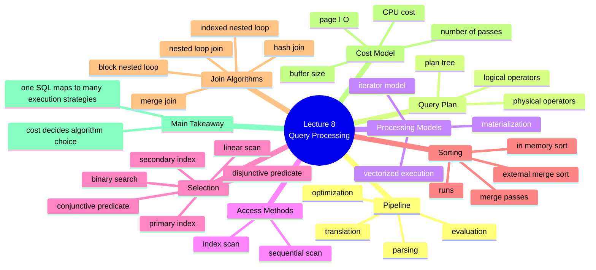

# Lecture 8 思维导图

```mermaid
mindmap
  root((Lecture 8<br/>Query Processing))
    Pipeline
      parsing
      translation
      optimization
      evaluation
    Query Plan
      logical operators
      physical operators
      plan tree
    Processing Models
      iterator model
      materialization
      vectorized execution
    Access Methods
      sequential scan
      index scan
    Selection
      linear scan
      binary search
      primary index
      secondary index
      conjunctive predicate
      disjunctive predicate
    Sorting
      in memory sort
      external merge sort
      runs
      merge passes
    Join Algorithms
      nested loop join
      block nested loop
      indexed nested loop
      merge join
      hash join
    Cost Model
      page I O
      CPU cost
      number of passes
      buffer size
    Main Takeaway
      one SQL maps to many execution strategies
      cost decides algorithm choice
```

