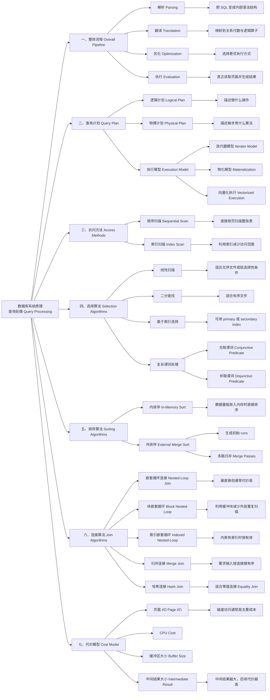

# Lecture 8 思维导图

```mermaid
flowchart LR
  A["数据库系统原理<br/>查询处理 Query Processing"]

  A --> B1["一、整体流程 Overall Pipeline"]
  A --> B2["二、查询计划 Query Plan"]
  A --> B3["三、访问方法 Access Methods"]
  A --> B4["四、选择算法 Selection Algorithms"]
  A --> B5["五、排序算法 Sorting Algorithms"]
  A --> B6["六、连接算法 Join Algorithms"]
  A --> B7["七、代价模型 Cost Model"]

  B1 --> C11["解析 Parsing"]
  B1 --> C12["翻译 Translation"]
  B1 --> C13["优化 Optimization"]
  B1 --> C14["执行 Evaluation"]

  C11 --> D111["把 SQL 变成内部语法结构"]
  C12 --> D121["映射到关系代数与逻辑算子"]
  C13 --> D131["选择更优执行方式"]
  C14 --> D141["真正读取页面并生成结果"]

  B2 --> C21["逻辑计划 Logical Plan"]
  B2 --> C22["物理计划 Physical Plan"]
  B2 --> C23["执行模型 Execution Model"]

  C21 --> D211["描述做什么操作"]
  C22 --> D221["描述每步用什么算法"]
  C23 --> D231["迭代器模型 Iterator Model"]
  C23 --> D232["物化模型 Materialization"]
  C23 --> D233["向量化执行 Vectorized Execution"]

  B3 --> C31["顺序扫描 Sequential Scan"]
  B3 --> C32["索引扫描 Index Scan"]
  C31 --> D311["直接按页扫描整张表"]
  C32 --> D321["利用索引减少访问范围"]

  B4 --> C41["线性扫描"]
  B4 --> C42["二分查找"]
  B4 --> C43["基于索引选择"]
  B4 --> C44["复杂谓词处理"]

  C41 --> D411["适合无序文件或低选择性条件"]
  C42 --> D421["适合有序文件"]
  C43 --> D431["可用 primary 或 secondary index"]
  C44 --> D441["合取谓词 Conjunctive Predicate"]
  C44 --> D442["析取谓词 Disjunctive Predicate"]

  B5 --> C51["内排序 In-Memory Sort"]
  B5 --> C52["外排序 External Merge Sort"]
  C51 --> D511["数据量能放入内存时直接排序"]
  C52 --> D521["生成初始 runs"]
  C52 --> D522["多路归并 Merge Passes"]

  B6 --> C61["嵌套循环连接 Nested-Loop Join"]
  B6 --> C62["块嵌套循环 Block Nested-Loop"]
  B6 --> C63["索引嵌套循环 Indexed Nested-Loop"]
  B6 --> C64["归并连接 Merge Join"]
  B6 --> C65["哈希连接 Hash Join"]

  C61 --> D611["最直接但通常代价高"]
  C62 --> D621["利用缓冲块减少外层重复扫描"]
  C63 --> D631["内表有索引时很有效"]
  C64 --> D641["要求输入按连接键有序"]
  C65 --> D651["适合等值连接 Equality Join"]

  B7 --> C71["页面 I/O Page I/O"]
  B7 --> C72["CPU Cost"]
  B7 --> C73["缓冲区大小 Buffer Size"]
  B7 --> C74["中间结果大小 Intermediate Result"]

  C71 --> D711["磁盘访问通常是主要成本"]
  C74 --> D741["中间结果越大，后续代价越高"]
```

