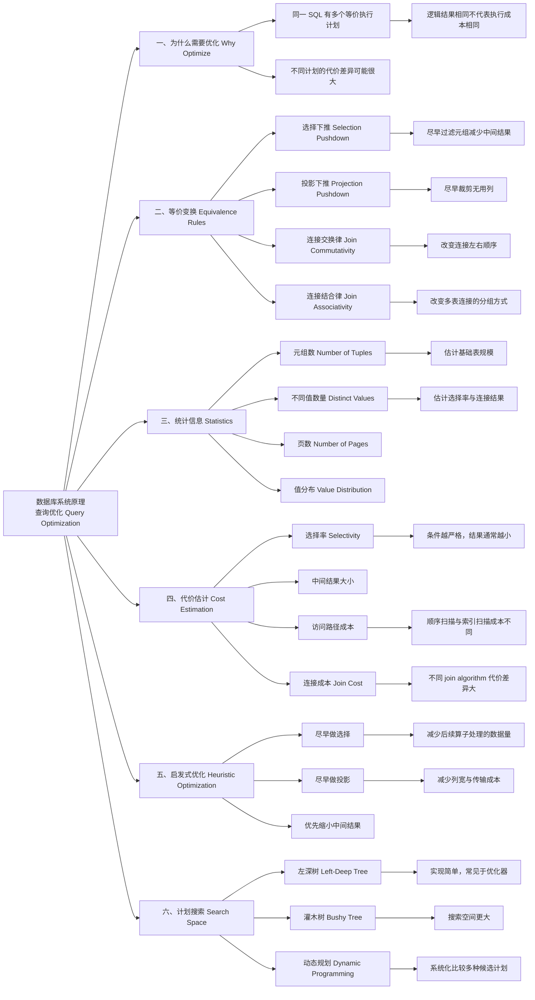

# Lecture 9 思维导图

```mermaid
flowchart LR
  A["数据库系统原理<br/>查询优化 Query Optimization"]

  A --> B1["一、为什么需要优化 Why Optimize"]
  A --> B2["二、等价变换 Equivalence Rules"]
  A --> B3["三、统计信息 Statistics"]
  A --> B4["四、代价估计 Cost Estimation"]
  A --> B5["五、启发式优化 Heuristic Optimization"]
  A --> B6["六、计划搜索 Search Space"]

  B1 --> C11["同一 SQL 有多个等价执行计划"]
  B1 --> C12["不同计划的代价差异可能很大"]
  C11 --> D111["逻辑结果相同不代表执行成本相同"]

  B2 --> C21["选择下推 Selection Pushdown"]
  B2 --> C22["投影下推 Projection Pushdown"]
  B2 --> C23["连接交换律 Join Commutativity"]
  B2 --> C24["连接结合律 Join Associativity"]

  C21 --> D211["尽早过滤元组减少中间结果"]
  C22 --> D221["尽早裁剪无用列"]
  C23 --> D231["改变连接左右顺序"]
  C24 --> D241["改变多表连接的分组方式"]

  B3 --> C31["元组数 Number of Tuples"]
  B3 --> C32["不同值数量 Distinct Values"]
  B3 --> C33["页数 Number of Pages"]
  B3 --> C34["值分布 Value Distribution"]

  C31 --> D311["估计基础表规模"]
  C32 --> D321["估计选择率与连接结果"]

  B4 --> C41["选择率 Selectivity"]
  B4 --> C42["中间结果大小"]
  B4 --> C43["访问路径成本"]
  B4 --> C44["连接成本 Join Cost"]

  C41 --> D411["条件越严格，结果通常越小"]
  C43 --> D431["顺序扫描与索引扫描成本不同"]
  C44 --> D441["不同 join algorithm 代价差异大"]

  B5 --> C51["尽早做选择"]
  B5 --> C52["尽早做投影"]
  B5 --> C53["优先缩小中间结果"]

  C51 --> D511["减少后续算子处理的数据量"]
  C52 --> D521["减少列宽与传输成本"]

  B6 --> C61["左深树 Left-Deep Tree"]
  B6 --> C62["灌木树 Bushy Tree"]
  B6 --> C63["动态规划 Dynamic Programming"]

  C61 --> D611["实现简单，常见于优化器"]
  C62 --> D621["搜索空间更大"]
  C63 --> D631["系统化比较多种候选计划"]
```
