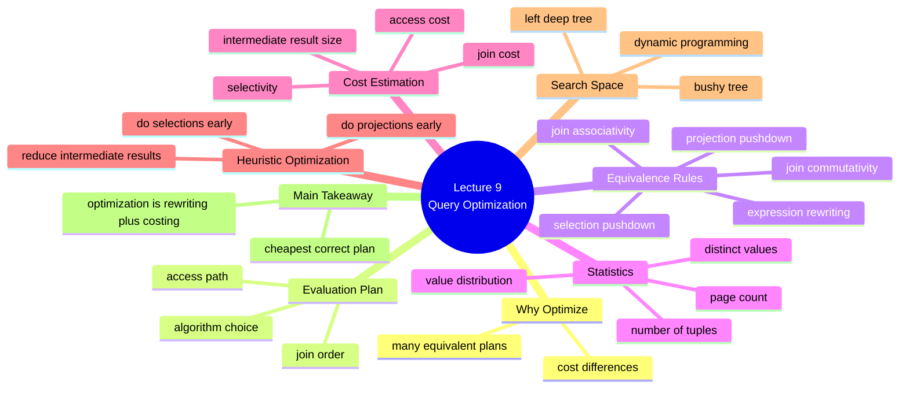

# Lecture 9 思维导图

```mermaid
mindmap
  root((Lecture 9<br/>Query Optimization))
    Why Optimize
      many equivalent plans
      cost differences
    Evaluation Plan
      algorithm choice
      join order
      access path
    Equivalence Rules
      selection pushdown
      projection pushdown
      join commutativity
      join associativity
      expression rewriting
    Statistics
      number of tuples
      distinct values
      page count
      value distribution
    Cost Estimation
      selectivity
      intermediate result size
      join cost
      access cost
    Heuristic Optimization
      do selections early
      do projections early
      reduce intermediate results
    Search Space
      left deep tree
      bushy tree
      dynamic programming
    Main Takeaway
      optimization is rewriting plus costing
      cheapest correct plan
```

