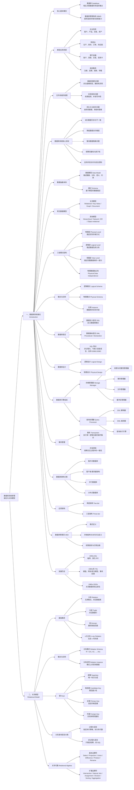

# 思维导图风格示例

下面这份示例改成了**横向树形结构图**，使用 Mermaid `flowchart LR`，用于确认你要的最终视觉方向。

```mermaid
flowchart LR
  A["数据库系统原理<br/>绪论与关系模型"]

  A --> B1["一、数据库系统绪论<br/>Introduction"]
  A --> B2["二、关系模型<br/>Relational Model"]

  B1 --> C11["核心基本概念"]
  B1 --> C12["典型应用场景"]
  B1 --> C13["文件系统的局限"]
  B1 --> C14["数据库系统核心目标"]
  B1 --> C15["数据抽象体系"]
  B1 --> C16["常见数据模型"]
  B1 --> C17["三级模式结构"]
  B1 --> C18["模式与实例"]
  B1 --> C19["数据库语言"]
  B1 --> C110["数据库设计"]
  B1 --> C111["数据库引擎组成"]
  B1 --> C112["事务管理"]
  B1 --> C113["数据库架构分类"]
  B1 --> C114["应用架构"]
  B1 --> C115["数据库管理员 DBA"]
  B1 --> C116["发展历史"]

  C11 --> D111["数据库 DataBase<br/>相互关联数据的有组织集合"]
  C11 --> D112["数据库管理系统 DBMS<br/>提供高效存储与检索能力"]

  C12 --> D121["企业信息<br/>客户、产品、交易、资产"]
  C12 --> D122["制造业<br/>生产、库存、订单、供应链"]
  C12 --> D123["银行金融<br/>账户、贷款、交易、信用卡"]
  C12 --> D124["高校教务<br/>注册、选课、成绩、学籍"]

  C13 --> D131["数据完整性问题<br/>非法值难校验、删除有异常"]
  C13 --> D132["实现效率问题<br/>检索低效、并发写冲突"]
  C13 --> D133["持久化与容灾问题<br/>崩溃丢数据、多副本困难"]

  C14 --> D141["减少数据冗余与不一致"]
  C14 --> D142["降低数据访问难度"]
  C14 --> D143["解决数据隔离问题"]
  C14 --> D144["保障完整性与原子性"]
  C14 --> D145["支持并发访问与安全控制"]

  C15 --> D151["数据模型 Data Model<br/>描述数据、关系、语义、约束"]
  C15 --> D152["模式 Schema<br/>基于模型的数据描述"]

  C16 --> D161["主流模型<br/>Relational / Key-Value / Graph / Document"]
  C16 --> D162["其他模型<br/>Hierarchical / Network / ER / Object-relational"]

  C17 --> D171["物理层 Physical Level<br/>描述实际存储方式"]
  C17 --> D172["逻辑层 Logical Level<br/>描述数据及其关系"]
  C17 --> D173["视图层 View Level<br/>描述完整数据库的一部分"]
  C17 --> D174["物理数据独立性<br/>Physical Data Independence"]

  C18 --> D181["逻辑模式 Logical Schema"]
  C18 --> D182["物理模式 Physical Schema"]
  C18 --> D183["实例 Instance<br/>数据库的实际内容"]

  C19 --> D191["数据定义语言 DDL<br/>定义数据库模式"]
  C19 --> D192["数据操纵语言 DML<br/>Procedural / Declarative"]
  C19 --> D193["SQL 特点<br/>非过程化、可嵌入高级语言、支持 ODBC/JDBC"]

  C110 --> D1101["逻辑设计 Logical Design"]
  C110 --> D1102["物理设计 Physical Design"]

  C111 --> D1111["存储管理器 Storage Manager"]
  C111 --> D1112["查询处理器 Query Processor"]

  D1111 --> E11111["权限与完整性管理器"]
  D1111 --> E11112["事务管理器"]
  D1111 --> E11113["文件管理器"]
  D1111 --> E11114["缓冲区管理器"]
  D1112 --> E11121["DDL 解释器"]
  D1112 --> E11122["DML 编译器"]
  D1112 --> E11123["查询执行引擎"]

  C112 --> D1121["事务 Transaction<br/>执行单一逻辑功能的操作集合"]
  C112 --> D1122["并发控制<br/>保障交互过程中的一致性"]

  C113 --> D1131["集中式数据库"]
  C113 --> D1132["客户端-服务器架构"]
  C113 --> D1133["并行数据库"]
  C113 --> D1134["分布式数据库"]

  C114 --> D1141["两层架构 Two-tier"]
  C114 --> D1142["三层架构 Three-tier"]

  C115 --> D1151["模式定义"]
  C115 --> D1152["存储结构与访问方法定义"]
  C115 --> D1153["权限授权与日常运维"]

  C116 --> D1161["1950s-60s<br/>磁带、穿孔卡片"]
  C116 --> D1162["1960s末-70s<br/>硬盘、网状/层次模型、事务处理"]
  C116 --> D1163["1980s-2020s<br/>关系数据库到云原生"]

  B2 --> C21["基础概念"]
  B2 --> C22["模式与实例"]
  B2 --> C23["键 Keys"]
  B2 --> C24["关系查询语言分类"]
  B2 --> C25["关系代数 Relational Algebra"]

  C21 --> D211["关系 Relation<br/>无序集合，对应数据表"]
  C21 --> D212["元组 Tuple<br/>对应数据行"]
  C21 --> D213["域 Domain<br/>属性取值范围"]
  C21 --> D214["n元关系 n-ary Relation<br/>包含 n 列的表"]

  C22 --> D221["关系模式 Relation Schema<br/>R = (A1, A2, …, An)"]
  C22 --> D222["关系实例 Relation Instance<br/>模式上的具体数据"]

  C23 --> D231["超键 Superkey<br/>唯一标识元组"]
  C23 --> D232["候选键 Candidate Key<br/>满足最小性"]
  C23 --> D233["主键 Primary Key<br/>选定的候选键"]
  C23 --> D234["外键 Foreign Key<br/>实现参照完整性"]

  C24 --> D241["过程化语言<br/>指定执行策略，如关系代数"]
  C24 --> D242["非过程化语言<br/>只描述结果，如 SQL"]

  C25 --> D251["基本运算符<br/>Select / Projection / Union / Difference / Product / Rename"]
  C25 --> D252["扩展运算符<br/>Intersection / Natural Join / Assignment / Division / Sorting / Aggregation"]
```
